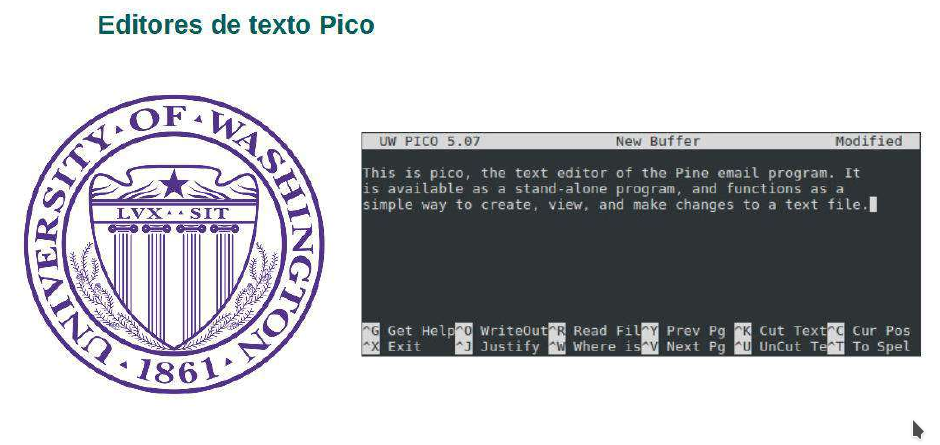
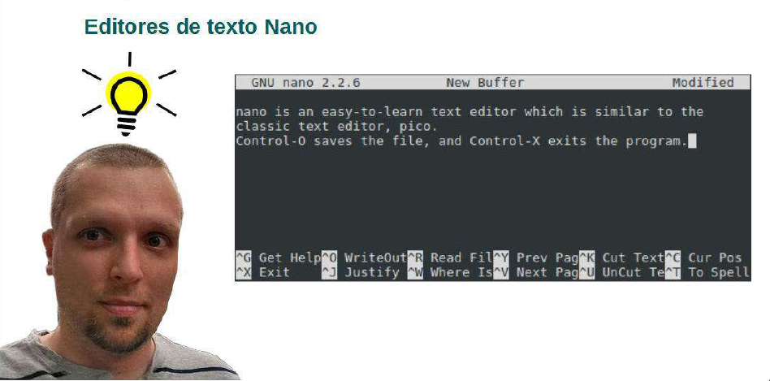
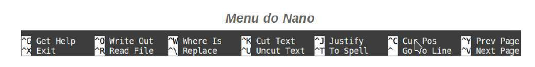
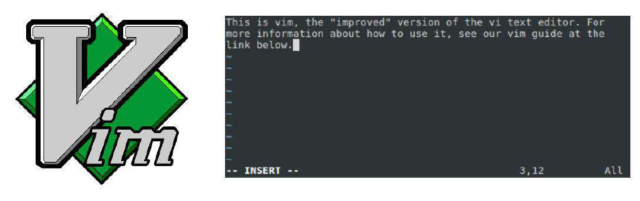
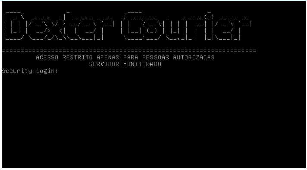
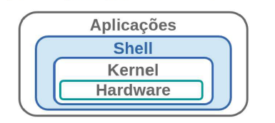

### Aula 02 - Editor de Textos e Shell
#### Aula 2.1 - Editores de Textos


- Vim
O "Vi" é o editor básico do GNU/Linux, e está disponível em grande parte das distribuições Linux, o
vim é uma versão mais completa e com mais recursos do que o "Vi", cujo seu significado é "Vim =
VI iMproved".

#### Outros Editores de Texto
- Vi – Sem dúvida nenhuma o editor mais famoso de todos os tempos, presente em quase todas
as distribuições.
- Nano – Editor padrão de muitas distribuições como Debian, CentOS, esse editor é diferente do
“vim” e é muito fácil de ser usado.
- Pico – Muito parecido com o “nano”, este está presente nas distribuições Slackware e Gentoo.
- Mcedit – Editor muito fácil e completo. Seu grande diferencial é a possibilidade da utilização do
mouse, mesmo no ambiente textual.
- Ed – O editor de textos mais simples no mundo Unix, o “ed” é um editor de linha para terminais
aonde não é possível abrir uma janela de edição.


```bash
touch arquivo1.txt
cat arquivo1.txt
```

```bash
> arquivo2.txt
cat arquivo2.txt
```

```bash
touch -d '01 May 2010 'arquivo1.txt
stat arquivo1.txt
```



- Pico
O histórico, clássico editor de texto para Linux, chama-se "Pico" ("Pine Composer").
Consiste na sessão para edição de texto de um antigo cliente para e-mail (originalmente em Unix)
chamado "Pine“.
O Pine e o Pico, na realidade, não são softwares livres, foram desenvolvidos pelo
Departamento de Computação Aplicada à Comunicação da Universidade de Washington. No início
da Internet, quando a Web ainda não existia, o Pine era o principal cliente para mandar e receber e-
mails.

```bash
~ pico # Para iniciar o editor pico
GNU/LINUX is  OpenSource
```

```bash
CTRL + O
pico.txt <ENTER>
CTRL + X
```

Após inserir o texto desejado, basta seguir a orientação dada pelo menu para realizar ações como navegar dentro do arquivo, recortar e colar textos, salvar o documento, etc.


Para salvar, basta teclar **'CTRL + O'**.

Após apertar as teclas, será solicitado o nome do arquivo a ser salvo, já que ele não foi atribuido no momento da abertura do arquivo.

Para sair sem salvar, basta teclar **'CTRL + X'**.



- nano

Nano é um editor de texto que deve ser executado a partir de um terminal, sua distinção
reside na simplicidade.
É um clone do antigo editor de texto Pico, o editor para o cliente de e-mail Pine, que foi muito
popular nos anos 1990, em UNIX e sistemas do tipo UNIX.
O Pine foi substituído pelo Alpine e o Pico pelo Nano, mas algumas coisas não mudaram -
assim como a simplicidade de edição com o Nano.
#<>

```bash
~ nano
GNU/LINUX is OpenSource
```

```bash
CTRL + O
nano.txt
CTRL + X
```



As teclas de atalho para realização de comandos dentro do NANO são basicamente as mesmas utilizadas no PICO

### VIM



O Vi é um dos mais antigos, (1976), editores de texto em linha de comando para Unix e
Linux. Derivado do Ed, do Ex, Joe e de outros editores de linha rudimentares.
O Vim (Vi Improved) é uma versão mais poderosa e maior em termos de espaço em disco e
requisitos de memória do editor de texto vi.

```bash
~ vimtutor # Utilizado para apresentar algumas funções do edtiro VIM, uma espécie de tutorial sobre o programa.
```
Para sair do tutor basta teclar **ESC** e em seguida digitar **:q!**

Outra maneira de acessar o tutor do vim é acessar o programa através do terminal digitando **vim** e em seguida **:help**.

Ao invocar o **“vim”**, este entra direto para o modo de “Visualização”. Para modificar o arquivo,
usam-se os modos de inserção, deleção e de substituição.
Para voltar ao modo de visualização, sempre se usa a tecla “ESC”, de forma que para entrar no
modo de inserção, use a tecla “i”.

- Criando um arquivo
A sintaxe para se criar um arquivo no vim é bem simples, sendo apenas o comando vim e o nome
do arquivo a ser criado, onde o mesmo será salvo no diretório corrente a sua criação.
Após digitar o texto, você precisará sair do modo de inserção para realizar qualquer outra ação,
para sair do modo de inserção digite ESC, assim como para salvar **:w**, salvar e sair **:wq**, e caso
queira forçar uma ação, adiciona um ponto de exclamação no final **:wq!** e **:q!** .

Antes de iniciar a prática com o vim, vamos copiar o arquivo **/etc/passwd** para o diretório **/tmp**.

```bash
~ cp /etc/passwd /tmp
~ vim /tmp/passwd
```

Dentro do vim, podemos trabalhar com dois modos de utilização, o **Modo de comando** e **Modo de inserção**:

- Para entrar no modo de inserção, basta teclar **i** enquando estiver no modo de comando;
- Para sair do modo de inserção e voltar ao modo de comando, basta teclar **ESC**.

### Comandos

- **gg** - Move o cursor para a primeira linha do documento;
- **G** - Move o cursor para a última linha do documento;
- **yy** - Copia a linha onde o cursor está posicionado;
- **cc** - Recorta a linha onde o cursor está posicionado;
- **pp** - Cola a(s) linha(s) que estão em buffer após cópias ou recortes de texto.


### Comando de pesquisa

- **/string** - O **/** permite realizar uma consulta dentro de um arquivo a partir de uma string definida pelo usuário;
- **?string** - O **?** também permite realizar uma consulta dentro de um arquivo a partir de uma string definida pelo usuario. No entanto, ele inverte o sentido da pesquisa. O **/** realiza a pesquisa do início para o fim do arquivo, o **?** realiza a pesquisa do final para o começo;
- **n** - Quando realizada a pesquisa a partir dos caracteres **?** ou **/**, o **n** vai para a próxima ocorrência da pesquisa realizada dentro do arquivo;
- **N** - Faz o oposto do **n**, e busca a ocorrência anterior da pesquisa realizada dentro do arquivo;


### Salvando e saindo de arquivos

Para salvar arquivos, o vim possui as opções **:wq**, **:x** ou **ZZ**, todas elas a serem utilizadas no Modo de Comando.

Para sair do arquivo sem realizar nenhuma operação de gravação, utiliza-se apenas a opção **:q**.

Para forçar a execução de algum destes comandos, basta utilizar o **!** após a execução deles (**:q!**,**:wq!**,**:x!**).

## Aula 2.2 VIM Avançado

### Objetivo:
Editar o arquivo **/etc/issue** para criar uma mensagem de login ao servidor customizada.

Utilizar comandos variados do vim para localizar, susbstituir e colar linhas dentro de um documento de texto.

Por segurança, antes de iniciar qualquer edição a arquivos de configuração, é importante realizar a cópia dos arquivos que editar para um diretório separado.

```bash
~ cp /etc/passwd /tmp
~ cp /etc/fstab /tmp
```

### Editar múltiplos arquivos

Após realizar a cópia dos arquivos, vamos utilizar a opção **-o** para abrir os dois arquivos que copiamos simultâneamente. Com a opção **-o**, a tela fica dividida horizontalmente.

```bash
~ vim -o /tmp/passwd /tmp/fstab
```
Utilizando a combinação de teclas < **CTRL + WW**> podemos alternar entre as duas janelas de arquivos abertos.

Para sair de todos os arquivos sem salvar, basta estar estar no Modo de Comando e teclar **:qa!**.

Para dividir a tela verticalmente, utiliza-se a opção **-O** e a navegação entre as janelas se dá da mesma forma que quando utilizada a opção **-o**, utilizando < **CTRL + WW** >.

Para salvar todos os arquivos e em seguida sair deles, utiliza-se a opção **:wqa** no Modo de Comando.

### Fazer substituições dentro de um arquivo de textos

Vamos editar o arquivo passwd que foi copiado anteriormente:

```bash
~ vim /tmp/passwd
```
Após acessar o arquivo, vamos utilizar expressões para editá-lo:

Para isso, no Modo de Comando devemos teclar **:% s/nologin/yeslogin/g**. O caractere **%** indica que a pesquisa deve ser realizada no arquivo inteiro, o **s** indica substituição dos textos e o **g** indica substituição global das strings, considerando não apenas as linhas e também as colunas.

Para voltar ao padrão anterior, devemos utilizar o comando **:% s/yeslogin/nologin/g**.

Em seguida, basta salvar o arquivo e sair teclando **:wq**.


### Opções do Modo de Comando

Vamos abrir o arquivo **/tmp/fstab** para testar opções adicionais do Modo de Comando do VIM.

```bash
~ vim /tmp/fstab
```
Após acessar o arquivo, dentro do Modo de Comando temos alguns comandos que podemos utilizar para facilitar a nossa vida durante a edição de arquivos.

- **:set** - Exibe o resumo de configurações padrão que já estão definidas em arquivos de configuração do VIM;
- **:set ic** - Ignora as buscas case sensitive;
- **:set number** - Realiza a numeração das linhas do arquivo;
- **:set nonumber** - Remove a numeração das linhas do arquivo, caso esteja habilitada;
- **:set hlsearch** - Realça as palavras que foram pesquisadas dentro do arquivo;
- **:set nohlsearch** - Desativa o realce das palavras que foram pesquisadas;
- **:syntax off** - Desabilita o uso de cores dentro do VIM;
- **:syntax on** - Habilita o uso de cores dentro do VIM, facilitando a leitura;
- **! ls /etc** - Executa um comando do shell estando dentro do arquivo de texto;
- **r! ls /etc** - Executa um comando do shell estando dentro do arquivo e redireciona a saída deste comando para dentro do arquivo.

#### Outras Opções

- **:split** - Divide a tela do vim horizontalmente;
- **:vsplit** - Dívide a tela do vim verticalmente;
- **:e <caminho_do_arquivo>** - Abre um arquivo estando dentro de outro arquivo.

#### Personalizando o editor

Para definir algumas permissões padrão no Vim, nós precisamos acessar acessar o arquivo **/etc/vim/vimrc**(no Debian) ou **/etc/vimrc**(em distribuições Red Hat) e definir as configurações dentro dele.

```bash
~ sudo vim /etc/vim/vimrc +$
```

Após acessar o arquivo **vimrc**, basta adicionar os parâmetros que já haviamos listado anteriormente, conforme abaixo.

```bash
....
set ic
set number
set hlsearch
syntax on
```

Após realizar as edições, utilizar **:wq** no Modo de Comando e salvar o arquivo.

#### Editando linhas
```bash
~ vim /tmp/passwd
```
No Modo de Comando do vim, vamos testar as opções a seguir:

- **:10 d** - Opção utilizada para excluir apenas a linha número 10 do arquivo;
- **:1;5 d** - Opção utilizada para excluir o intervalo das linhas 1 a 5;
- **:1;5 y** - Opção utilizada para copiar o intervalo da linha 1 até a linha 5;
- **:10** - Move o cursor para a linha de número 10;
- **p** - Usado para colar as linhas que estão em buffer (sejam elas copiadas ou recortadas).
- **:1;10 s/nologin/yeslogin/g** - Substitui a string *nologin* pela *yeslogin* no intervalo da linha 1 até a linha 10;
- **:g/nologin/d** - Remove linhas que possuam a string *nologin*;
- **:1;10 g/nologin/d** - Remove linhas que possuam a string *nologin* e estejam no intervalo da linha 1 até a linha 10

Após realizar todos os comandos, vamos continuar a prática editando linhas de um outro arquivo.

```bash
~ cp /etc/adduser.conf /tmp/
~ vim /tmp/adduser.conf
```

Após acessar o arquivo vamos utilizar mais alguns comandos para manipular remover as linhas em branco e linhas comentadas presentes dentro do arquivo, conforme abaixo:

- **:g/^\s\*$/d** - remove apenas as linhas em branco
- **:g/^\s\*#/d** - remove apenas as linhas comentadas

Após realizar esse teste, podemos sair do arquivo sem salvá-lo, utilizando '**:q!**'.

#### Personalizar arquivo de mensagem de login

Antes de começarmos a edição do arquivo de mensagem de login do sistema, precisaremos instalar um pacote, o **figlet**.

```bash
~ sudo apt install figlet
```

Após a realização do comando de instalação, podemos utilizar o comando **figlet** para criar a mensagem de boas vindas que queremos inserir no arquivo **/etc/issue**.

```bash
~ figlet Dexter Courier
```

Após utilizar o pacote que acabamos de instalar, vamos encaminhar a saída deste comando para o arquivo **/etc/issue**.

Não temos permissões para realizar essa ação, por isso, precisaremos alternar para o usuário *root*.

```bash
~ sudo su -
~ figlet Dexter Courier > /etc/issue
```

Ao final do arquivo **issue**, adicionaremos a mensagem:

```bash
=============================================================
        ACESSO RESTRITO APENAS PARA PESSOAS AUTORIZADAS
                   SERVIDOR MONITORADO
```

Sem sair do arquivo **issue**, precisamos substituir as barras invertidas **"\\"** por **"\\\\"**, pois o shell não interpretará uma barra única.

Dentro do modo de comando do vim, deveremos utilizar o comando **:%s/\\/\\\\/g**.

Após realizar estas edições, basta salvar o arquivo e sair utilizando **:x** e em seguida testar o acesso local da máquina.



#### Aula 2.3 Configurar Shell e Timezone



O que é uma shell?

Podemos definir uma “shell” como a camada de acesso ao sistema básico no sistema operacional do computador.

Uma “shell” pode ser personalizada para atender as necessidades do administrador. Como exemplos de personalização podemos citar a definição de um idioma padrão, personalização e
automatização de processos entre outras coisas.

Nos tópicos a seguir, veremos como fazer algumas dessas personalizações nos servidores da empresa Dexter.
O BASH é um interpretador do Shell, ele é utilizado como padrão de diversas distribuição Linux.

Atalhos do BASH:
- CTRL + W Apaga a ultima palavra;
- CTRL + U Apaga toda a linha;
- CTRL + R Executa busca reversa no History;
- CTRL + D Sai do terminal;
- ESC +. Insere no terminal o ultimo termo do ultimo comando.

##### Variáveis
Variáveis de ambiente (ou globais) têm seus nomes sempre em maiúsculas;
Variáveis de shell (ou locais) têm seus nomes sempre em maiúsculas;
O shell em si não faz distinção de nomes em maiúsculas ou minúsculas pra ele são a mesma
coisa. A diferença é apenas para ajudar na interpretação do usuário.

Tendo o conceito em mente, agora vamos praticar com variáveis dentro do **shell**.

Pra começar, vamos criar uma variável de ambiente chamada **"LOCAL"** com o valor **"valor"**

```bash
~ LOCAL=valor
~ echo $LOCAL
```
 Após a execução do comando **echo**, o shell deve retornar a string **"valor"**.

 ```bash
~ bash
~ echo $LOCAL
 ```

 ##### Variável Local

 Após executar um novo **bash** e em seguida executar o **echo** para exibir o valor da variável, é importante observar que a saída do comando realizado não retorna valor nenhum.
 Isso ocorreu porque a variável que criamos anteriormente é uma variável local, isto é, funciona somente na sessão do shell em que ela foi definida.
 Como iniciamos um novo shell sem exportar a variável, é como se ela nunca tivesse existido.

 ##### Descrição dos comandos

 - echo — Mostra mensagens. A opção -n pode ser usada para que não ocorra o salto de linha após a mensagem ser mostrada.

 - bash — Inicia uma nova sessão do interpretador de comandos.

Para solucionarmos essa dificuldade enfrentada com a variável local, basta exportarmos a variável que queremos utilizar.

Para exportar uma variável no momento em que a definirmos, utilizamos o comando **export**, este comando também é capaz de exportar variáveis que já haviam sido declaradas anteriormente.

```bash
~ export CURSO=Linux
~ echo $CURSO
```
Vamos realizar um teste, vamos iniciar um novo shell e em seguida utilizar um **echo** para exibir o valor da variável. O valor de saída do comando deve ser idêntico ao da saída da execução anterior.

```bash
~ bash
~ echo $CURSO
```

Vamos verificar em qual bash estamos conectados para comprovar que o EXPORT da variável funcionou corretamente.

```bash
~ echo $SHLVL
~ exit
```

##### Variável Global
Quando criamos uma variável com o comando EXPORT, estamos declarando que esta variável terá o seu valor exportado a partir deste bash para todos os outros que vierem a ser abertos a partir dele.

A variável **SHLVL** armazena o valor de qual bash estamos logados no momento.

Exemplo:

Caso estivéssemos no primeiro bash, o valor da variável **SHLVL** seria 1, o segundo bash teria o valor 2 e assim sucessivamente.

Dentro do shell, nós podemos listar as variáveis de ambiente existentes com os comandos **set** e **env**.

```bash
~ set
```
O **set** exibe na tela todas as variáveis de ambiente existentes atualmente, sejam elas apenas variáveis locais ou variáveis globais.


```bash
~ env
```

O **env** também exibe na tela variáveis de ambiente existentes, porém, a saída do comando exibe apenas as variáveis exportadas (globais). Além disso, o env também é capaz de alterar o valor de uma variável apenas no momento da execução de um comando específico.

Para excluir uma variável é necessário utilizar o comando **unset** *[nome da variavel]*.

```bash
~ echo $CURSO
~ unset CURSO
~ echo $CURSO
```

Todo software que é executado no Linux precisa de várias informações para que possa funcionar corretamente: nome de usuário, tamanho do terminal, tipo do terminal, localização do executável, localização de alguma biblioteca, etc.

Sem este tipo de informação não é possível utilizar o sistema de modo produtivo já que seria necessário passar tais informações a cada programa que for usar – e todas as vezes que for usar o mesmo programa.

Quais são as variáveis mais importantes?
Algumas variáveis você vai encontrar em qualquer sistema Linux que você utilizar. Elas definem alguns parâmetros importantes para que você consiga usar o sistema tranquilamente, sem ter que ficar lembrando parâmetros antes de começar a usar o sistema.

Algumas destas variáveis são:
- HOME: Define o diretório home do usuário logado;
- PATH: Define os diretórios usados para encontrar os comandos;
- SHELL: Define o shell que está sendo utilizado;
- PWD: Define em qual diretório você está no momento;
- USER: Define o usuário que está logado;
- EDITOR: Define o editor de textos padrão para aplicações que invocam editores de texto automaticamente.

Se não existisse uma variável de ambiente chamada PATH você teria que digitar todo o caminho do comando para listar por exemplo: ls. Quando você digita o comando ls, o sistema busca esse comando em algum diretório que esteja na variável PATH.

Visualizar o conteúdo de uma variável:
echo $PATH

Vamos ver na prática as variáveis **HOME**, **USER**, **PATH**, **PWD**, **SHELL** E **EDITOR**, vamos digitar os comandos abaixo no terminal:

```bash
~ echo $HOME
~ echo $USER
```

```bash
~ echo $PATH
~ echo $PWD
```

```bash
~ echo $SHELL
~ echo $EDITOR
```

Para editar o nosso prompt de comando, podemos alterar alguns valores que ficam armazenados na variável PS1.
Podemos alterar esta variável para personalizar como será o layout do nosso **ps1** no shell.

Para isso, precisamos conhecer alguns parâmetros:

Argumento | Descrição
----------|----------
\W | Diretório corrente
\w | Caminho completo do diretório corrente
\u | Nome do usuário
\t | Hora do sistema
\d | Data
\h | Host da máquina
\$ | Identificação do usuário (# ou $)

Para editar a ps1, temos como exemplo o comando a seguir:

```bash
~ export PS1='\h-[\W]\u >'
```

Quando o usuário se loga, o sistema fará a autenticação, configurará o ambiente e iniciará o shell. No caso do bash, o próximo passo é a leitura do arquivo /etc/profile;

Este arquivo contém comandos que são executados para todos os usuários do sistema no momento do login. Somente o usuário root pode ter permissão para modificar este arquivo;

Este arquivo é lido antes do arquivo de configuração pessoal de cada usuário (.profile, .bash_profile, .bash_logout e .bash_login).

Ordem de Carregamento:
Se este arquivo /etc/profile não existir, o shell processa o conteúdo armazenado nos arquivos: /.bash_profile, /.bash_login e /.bash_logout nessa ordem.

Se não existe nenhum o arquivo /etc/bashrc é executado.
- ~/.bash_profile: executado por shells que usam autenticação (evento de login);
-  ~/.bashrc: executado por shells que não usam autenticação (não é um evento de login);
-  ~/.bash_login: executado quando um usuário efetua o login;
-  ~/bash_logout: executado quando um usuário efetua o logout.

Executar um comando no login e logout
Para que um comando seja executado quando o usuário efetua LOGIN (iniciar uma sessão) ou
LOGOUT (finalizar a sessão), insira o seu comando nos respectivos arquivos que devem estar
localizados no HOME de cada usuário:
.bash_login
.bash_logout


Vamos agora definir uma mensagem padrão de boas vindas no arquivo **.bash_login**. Não temos o arquivo criado em nossa *home*, por isso vamos criá-lo com o **vim** e inserir a mensagem de boas vindas.
É importante notar que, o arquivo **.bash_login** será lido apenas se o arquivo **.bash_profile** não exista.

```bash
~ vim .bash_login
echo Bem vindo ao Linux!
```

Após criar a mensagem de login, vamos criar também a mensagem de logout no arquivo **.bash_logout**.


```bash
~ vim .bash_logout
clear
echo "Obrigado por utilizar nosso sistema!"
sleep 3
```

O comando **sleep** serve para criar um atraso na execução de um comando, caso o usuário precise que o sistema espere por algum tempo para executar uma determinada ação num script, por exemplo.


#### Personalizando o shell

Após editar as mensagens de boas vindas e de logout, vamos definir algumas configurações padrão do ambiente shell para o usuário **root**. Para isso, vamos editar o arquivo **.bashrc** presente no home do root (**/root**).

```bash
~ sudo su -
~ vim .bashrc
export LS_OPTIONS='--color=auto'
eval "`dircolors`"
alias ls='ls $LS_OPTIONS'
alias ls='ls $LS_OPTIONS -l'
alias ls='ls $LS_OPTIONS -lA'
alias rm='rm -i'
alias cp='cp -i'
alias mv='mv -i'
```
#### Descrição dos comandos

- alias — Permite criar um apelido a um comando ou programa. Para remover o apelido use o
comando unalias.


No exemplo de entrada do arquivo *.bashrc* exibido acima, foram adicionadas diversas entradas de *alias* para realizar alterações leves nos comportamentos dos comandos **ls**, **rm**, **cp** e **mv**.

Por exemplo, após inserir as entradas de *alias* dos comandos, adicionamos o parâmetro **-i** como padrão para os comandos **rm**, **cp** e **mv**. Assim dispensamos a necessidade de utilizar **-i** na execução de cada comando.

adicionar descrição das linhas inseridas no exemplo do arquivo .bashrc


##### Auditando o Shell
A variável TMOUT é responsável por controlar o tempo de inatividade do Shell.
Declarando ela no arquivo /etc/profile qualquer usuário que logar no modo texto e ficar inativo por
300 segundos (5 minutos) será deslogado automaticamente.
Definir a variável TMOUT no SHELL:

```bash
$ sudo su -
# echo $TMOUT
# export TMOUT=300 (Segundos)
# set | grep TMOUT
# vim /etc/profile
export TMOUT=120
# source /etc/profile
# echo $TMOUT
```

Após editar o arquivo **.bashrc** precisamos executar o comando **source** para forçar o carregamento destas configurações, pois o sistema assumiu como configurações os padrões que já estavam pré definidos antes de editarmos o arquivo.

```bash
~ source .bashrc
```
#### Descrição dos comandos

- source — Permite ler e executar comandos de um arquivo no shell atual.

Hora de verificar se as variáveis de ambiente e os '*aliases*' foram carregados corretamente.

```bash
~ echo $LS_OPTIONS
~ alias
```

##### Auditando o Shell

Para remover os comandos duplicados usa-se a variável HISTCONTROL.

A quantidade de comandos que será armazenado no history é definido na variável HISTSIZE
(Padrão CentOs 500 e Debian 1000).

A personalização é feita na variável HISTTIMEFORMAT.

Implementar Registro de Data e Hora no History:

```bash
# history
# echo $HISTSIZE
# echo $HISTFILE
# vim /root/.bashrc
export HISTSIZE=1000
export HISTCONTROL='erasedups'
export HISTTIMEFORMAT='%d-%m-%Y %H:%M - '
# source /root/.bashrc
# history
```


#### Ajustando o Timezone do sistema


Alterando o idioma do sistema
As principais variáveis usadas para determinar qual idioma os programas localizados utilizarão
são:

- **LANG**: Especifica o idioma_PAIS local. Podem ser especificados mais de um idioma na mesma
variável separando-os com **:**, desta forma caso o primeiro não esteja disponível para o
programa o segundo será verificado e assim por diante;
- **LC_MESSAGES**: Especifica o idioma que serão mostradas as mensagens dos programas. Seu
formato é o mesmo de LANG;
- **LC_ALL**: Configura todas as variáveis de localização de uma só vez. Seu formato é o mesmo
de LANG.

##### Alterando o idioma do sistema

Para alterar o idioma do sistema, primeiro precisamos adicionar os pacotes de idioma correspondentes. Vamos adicionar os pacotes **pt_BR** e **pt_BR-UTF-8** por meio do comando **locale-gen**


```bash
~ locale-gen pt_BR
~ locale-gen pt_BR.UTF-8
```

Após adicionar os pacotes, vamos reconfigurar o locale padrão do sistema.

```bash
~ dpkg-reconfigure locales
```

A seguir, devemos definir o idioma padrão do sistema a partir do comando **update-locale**

```bash
~ update-locale LANG=pt_BR.UTF-8
```

##### Descrição dos comandos

- **locale-gen** — Permite gerar arquivos de localização de modelos.
- **dpkg-reconfigure** — Permite reconfigurar um pacote já instalado.
- **update-locale** — Permite modificar configurações globais de localidade.


#### Alterando a timezone

Antes de realizar a alteração, devemos checar qual é a TimeZone padrão do sistema configurada atualmente:
Para verificar isso podemos utilizar o comando cat no arquivo correspondente.

```bash
~ cat /etc/timezone
```

Em seguida, podemos listar as timezones disponíveis, executando o comando **timedatectl**:

```bash
~ timedatectl list-timezones
```

Sabendo as timezones disponíveis, podemos enfim definir uma nova timezone para o nosso sistema.

```bash
~ timedatectl set-timezone America/Sao_Paulo
```

##### Descrição dos comandos

- **timedatectl list-timezones** — Lista os fusos horários disponíveis, um por linha.
- **timedatectl set-timezone** — Defina o fuso horário do sistema para o valor especificado. Esta
chamada irá alterar o link simbólico /etc/localtime.

Além de definir nossa própria timezone, podemos checar também informações sobre outras timezones existentes.
Nos comandos a seguir, vamos buscar informações das timezones das cidades do Cairo e de Moscou, respectivamente:

```bash
~ TZ=Africa/Cairo date
~ TZ=Europe/Moscow date
```


<!-- ### LAB GAMIFICATION 2

- 1 - Abrir de forma vertical no editor VIM os arquivos /etc/passwd e /etc/fstab;
- 2 - Utilizar o editor VIM para abrir o arquivo /etc/group na última linha;
- 3 - Configurar de forma definitiva o destaque da string pesquisada no VIM;
- 4 - Abrir de forma horizontal no editor VIM os arquivos /etc/group e /etc/hosts;
- 5 - Declarar uma variavel global de nome LAB com o valor LINUX;
- 6 - Listar somente as variaveis globais;
- 7 - Definir o comando para limpar a tela no logout da sessão;
- 8 - Definir o comando para mostrar o calendário no login da sessão;
- 9 - Criar o apelido linuxcommand para o comando cal no arquivo .bashrc;
- 10 - Executar o comando para listar as timezones disponíveis. -->
