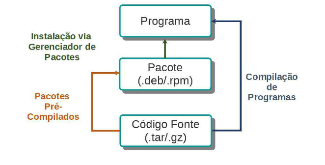
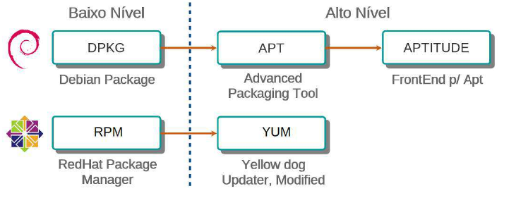
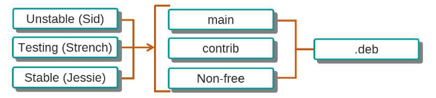
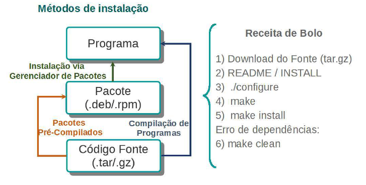
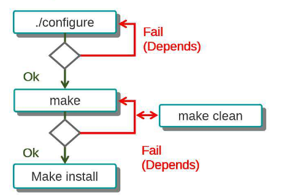
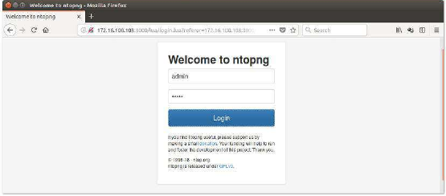

### Aula 03 - Instalação de Programas

Nesta aula, aprenderemos como configurar repositórios e gerenciar pacotes em distribuições como Debian e CentOS.

No dia a dia, é bastante comum precisarmos utilizar pacotes que eventualmente não estejam instalados nos sistemas que estamos operando.

Por isso é essencial que conheçamos meios de poder instalar os pacotes que precisamos, bem como instalar os repositórios de onde estes pacotes são disponibilizados.

#### Aula 3.1 Gerenciadores de Pacotes



Existem 3 formas de instalar pacotes em sistemas Linux:

- Instalação via gerenciadores de pacotes como o apt(Debian), o yum(RedHat) e o zypper(OpenSuse), por exemplo;
- A partir de pacotes pré-compilados (arquivos com as extensões .deb ou .rpm);
- A partir do código fonte do pacote.

Existem gerenciadores de pacotes de alto nível (apt/yum/zypper) e de baixo nível (rpm/dpkg), os de alto nível são os que nos permitem maior comodidade durante a instalação de pacotes, pois tratam dependências e exige uma instalação "menos interativa" se comparados aos gerenciadores de baixo nível.



##### Afinal, o que é um gerenciador de pacotes?

Nada mais é do que um sistema que efetivamente gerencia os programas instalados numa distribuição Linux. A partir dele, podemos tanto instalar novos pacotes e suas respectivas dependências, como também podemos realizar atualização dos pacotes que já estão instalados no sistema, e por fim realizar a remoção destes mesmos pacotes, caso seja necessário.

Vamos verificar as características de se utilizar os gerenciadores de baixo e de alto nível:

  **Baixo nível** | **Alto Nível**
------|------
Instalação manual | Instalação automática
Não trata dependências | Trata dependências
Difícil manter compatibilidade de versões | Fácil manter compatibilidade de versões
Tendência a manter lixo no sistema | Remove pacotes deixando o sistema limpo

##### APT / YUM

A principal função dos gerenciadores de alto nível como o **apt** e o **yum** é realizar a pré-instalação dos pacotes. Primeiro fazem o download dos pacotes e suas dependências e auxiliam o DPKG e o RPM passando instruções para que realizem a instalação.

##### Ciclo de desenvolvimento Debian



As versoes de pacotes em desenvolvimento pela comunidade Debian, são basicamente distribuídos em 3 nichos, **Unstable(Sid)**, **Testing(Strench)** e **Stable(Jessie)**. Estas divisões servem para segregar os estágios de desenvolvimento de cada aplicação:

- **Unstable** - Últimas versões de programas, mas que ainda não foram homologadas;
- **Testing** - Versões recentes que já estão em homologação para as próximas versões;
- **Stable** - Não são necessáriamente as versões mais novas de cada programa, porém já foram testadas e homologadas pela comunidade.

###### Curiosidade Debian

Desde 1996, as versões do Debian são batizadas com o nome dos personagens do filme Toy Story. Essa ideia veio de Bruce Perens, que assumiu a liderança do Projeto Debian e trabalhava na Pixar, onde o filme foi produzido na época.


##### Repositórios Debian

No arquivo **/etc/apt/sources.list** estão listados os locais onde o **APT** buscará os pacotes que precisaremos instalar.
Em cada entrada do reposítorio estarão listados parâmetros relacionados a versão da distribuição (stable, testing, unstable) e a seção do repositório(main, non-free, contrib, non-US, etc).

O método de acesso ao repositório pode variar de acordo como a entrada é inserida, por exemplo:

- As entradas mais comuns possuem s string **"http://..."** indicando um repositório presente na internet;
- Caso o repositório seja um CD com pacotes, a entrada correspondente seria **"cdrom://"**;
- Por fim, existem também a opção de repositórios locais, que teria o método de entrada **file://**.


Exemplo de entrada do arquivo **"/etc/apt/sources.list"**:

```bash
 deb http://http.us.debian.org/debian stable main contrib non-free
```

Vamos checar o arquivo de configuração de repositório da nossa máquina Debian:

```bash
~ cat /etc/apt/sources.list
```

Caso os repositórios estejam configurados corretamente, para atualizar a lista de pacotes disponíveis no repositório, utilizamos o comando **apt** com o parâmetro **update**.

##### Configuração do repositório Debian

```bash
~ sudo apt update
```

Após atualizar a lista de pacotes disponíveis, podemos listar os pacotes instalados em nossa máquina que possuem atualizações disponíveis.

```bash
~ sudo apt list --upgradable
```

Para atualizar a distribuição do SO, utilizamos o comando **apt** com o parâmetro **dist-upgrade**.

```bash
~ sudo apt dist-upgrade
```

##### Repositórios RedHat

Para configurar reposítórios em distribuições baseadas em RedHat temos duas opções.

Adicionando as entradas correspondentes aos repositórios no arquivo **/etc/yum.conf** ou criando arquivos separados dentro do diretório **/etc/yum.repos.d/**. É importante saber que só se pode utilizar as configurações de repositório apenas em um desses locais.

Como se pode notar, a configuração de repositórios dentro de um sistema baseado em RedHat é diferente da configuração dos repositórios no Debian.

Enquanto no Debian se concentram todas as entradas de repositório no arquivo **/etc/apt/sources.list**, os sistemas RedHat concentram arquivos **.repo** separados para cada repositório que está adicionado na máquina.

Abaixo temos um exemplo de arquivo de configuração de repositório utilizado em sistemas baseados em RedHat.

```bash
[main]
cachedir=/var/cache/yum/$basearch/$releasever
keepcache=1
debuglevel=2
logfile=/var/log/yum.log
obsoletes=1
gpgcheck=1
```

Alguns outros parâmetros que também podem ser adicionados nos arquivos **.repo**.

- **name** — Nome descritivo, no exemplo: CentOS (versão da distribuição);
- **baseurl** — O endereço que contém a lista dos programas e os pacotes;
- **enabled** — Se o repositório está ativo ou não (1 significa sim, 0 significa não);
- **gpgcheck** — Se todos os pacotes devem ter sua autenticidade verificada (extremamente
recomendado, 1 significa sim, 0 significa não);
- **gpgkey** — Qual chave criptográfica utilizar para a verificação dos pacotes.

##### Configuração do repositórios RedHat / CentOS

Vamos listar as configurações dos arquivos **yum.conf** e do repositório base do CentOS.

```bash
~ cat /etc/yum.conf
~ cat /etc/yum.repos.d/CentOS-Base.repo
```

Após checar as configurações atuais, vamos instalar o repositório **EPEL Release**, bastante utilizado em distribuições RedHat.

```bash
~ sudo yum install epel-release
```

Após instalar o repositório EPEL, vamos realizar a atualização dos pacotes do sistema, a partir do comando **yum update**.

Caso a opção seja apenas atualizar um único pacote, basta citar o nome do pacote após o comando.

```bash
~ sudo yum update
~ sudo yum update vim
```

Diferentemente do **apt**, o **yum** atualiza a lista de pacotes dos repositórios todas as vezes em que uma instalação é executada. O gerenciador atualiza as listas dos repositórios, baixa os headers dos pacotes e calcula as dependências necessárias antes de confirmar a instalação.

Isso elimina a necessidade de realizar o *update* das listas manualmente antes de cada instalação ou upgrade de pacote.

##### Gerenciar Pacotes com o APT

Vamos checar primeiro as opções que o comando **apt** possui:

```bash
~ sudo apt --help
```

Depois de checar as opções vamos pesquisar e instalar um pacote que deixa a saída de logs do sistema colorida:
```bash
~ sudo apt search "log coloriser"
~ sudo apt show ccze
~ sudo apt install ccze
```

Depois de instalado, vamos testar o funcionamento da ferramenta redirecionando a saída dos logs para o comando ccze.
```bash
~ sudo tailf /var/log/messages | ccze
```

###### Descrição dos comandos

- **apt search** — Busca pacotes relacionados a palavra-chave definida pelo usuário. O mesmo resultado por ser obtido pelo comando **apt-cache search**.
- **apt show** — Mostra informações detalhadas de um pacote. O mesmo resultado por ser obtido pelo comando **apt-cache show**.
- **apt install** — Realiza a instalação de um pacote.

Após checar o funcionamento da ferramenta ccze, vamos removê-la do nosso sistema e em seguida checar se ela realmente foi desinstalada.

```bash
~ sudo apt remove ccze
~ sudo dpkg -l | grep ccze
```

Podemos notar que apesar de desinstalarmos o pacote, ainda fica algo da instalação presente no sistema, para remover totalmente os dados é necessário utilizar a opção **--purge**:
```bash
~ sudo apt remove --purge ccze
~ dpkg -l | grep ccze
```

##### Descrição dos comandos
- apt remove
 — Remove um pacotes e suas dependências. A flag --purge remove
completamente o pacote incluindo arquivos de configuração.

##### Funcionalidades Avançadas

```bash
$ sudo apt clean # clean — Limpa o diretório de pacotes que são baixados para realizar uma instalação;
$ sudo apt autoremove # autoremove — Localiza e remove todos os pacotes “orfãos”;
$ sudo apt -f install # -f install — Aciona o sistema de resolução de problemas do APT;
$ sudo apt -f remove # -f remove — Similar ao “-f install”, porém ele dá preferência para remover os pacotes com problemas ao invés de tentar instalar;
Baixar o pacote no formato .DEB sem realizar a instalação
$ sudo apt -d install htop # -d - Baixa o pacote no formato .DEB sem realizar a instalação;
$ ls /var/cache/apt/archives # lista os arquivos baixados pelo apt.
```

##### Gerenciar pacotes com o yum

A exemplo do apt, vamos checar as opções disponíveis para o comando **yum** utilizando a flag **--help**.
```bash
~ sudo yum --help
```

Após checar as opções, vamos listar os repositórios que estão configurados em nossa máquina:
```bash
~ sudo yum repolist
```

Em seguida, vamos pesquisar e checar as informações relacionadas ao pacote "linux_logo".
```bash
~ sudo yum search "linux logo"
~ sudo yum info linux_logo
```

##### Descrição dos comandos
 - yum repolist — Valida quais repositórios estão sendo usados.
 - yum search — Busca pacotes relacionados a palavra-chave.
 - yum info — Mostra informações detalhadas de um pacote.

Depois de checadas as informações, podemos realizar a instalação do pacote e em seguida vamos testá-lo:

```bash
~ sudo yum install linux_logo
~ linux_logo -L23
```

Depois de utilizar o pacote, podemos removê-lo do sistema, utilizando o comando **yum remove**.

```bash
~ sudo yum remove linux_logo
```
Após realizar a remoção com o yum, vamos checar se realmente o pacote foi removido, utilizando o comando **rpm** com a opção **-qa**:

```bash
~ sudo rpm -qa | grep linux logo
```
##### Descrição dos comandos
- yum install — Instala um pacote.
- yum remove — Remove um pacotes e suas dependências.

##### Funcionalidades Avançadas

Limpar o diretório de pacotes através do comando yum clean all:
```bash
$ ls -R /var/cache/yum
$ sudo yum clean all # - clean all — Limpa o diretório de pacotes que são baixados para realizar uma instalação;
$ sudo yum upgrade # upgrade - Caso disponível atualiza a distribuição do CentOS;
$ sudo yum install ccze -y --downloadonly # --downloadonly — Plugin do Yum para realizar o download de pacotes sem realizar a instalação do mesmo.
```

Vamos listar se há pacotes do ccze baixados pelo yum no diretório de cache do gerenciador:
```bash
$ cd /var/cache/yum/x86_64/7/
$ ls epel/packages/ccze*
```
#### Aula 3.2 Gerenciar pacotes DPKG e RPM

Nesta aula, conheceremos um pouco mais sobre os gerenciadores de pacote de baixo nível, manipulando pacotes com as ferramentas **DPKG** e **RPM**.

##### Conhecendo o comando DPKG

Vamos começar verificando as opções do comando **dpkg** com a opção **--help**.

```bash
~ sudo dpkg --help
```


Após veriicar as opções disponíveis com o comando anterior, vamos utilizar a opção **-l** para listar os pacotes instalados na máquina atualmente.

```bash
~ sudo dpkg -l
~ sudo dpkg -l | egrep 'htop|bash|sudo'
~ sudo dpkg -l | egrep "libc6|libncursesw5|libtinfo5"
```

Vamos verificar o status do pacote **bash** instalado, utilizando a opção **-s**.

```bash
~ sudo dpkg -s bash
```

##### Opções do comando dpkg

#<! VALIDAR dpkg --help>
- **-l** (list) — Lista todos os programas instalados;
- **-s** (status) — Verifica o status de um programa instalado;
- **-S** (search) — Busca o nome do programa que instalou determinado comando, arquivo ou biblioteca;
- **-I** (Info)** — Exibe informações de um pacote a ser instalado;
- **-i** (install) — Realiza a instalação de um pacote;
- **-L** (list) — Lista todos os arquivos gravados no disco referente a um programa instalado.

A partir da opção **-S** do **dpkg** vamos listar o programa que realizou a instalação do comando top.

```bash
~ which htop
~ sudo dpkg -S /usr/bin/top
```

Para listar informações de um pacote a ser instalado, é necessário utilizar a opção **-I** do comando **dpkg**.

```bash
~ sudo dpkg -I /opt/pacotes/htop.deb
~ sudo dpkg -I /opt/pacotes/htop.deb | grep -i depends
```

Após ter checado as informações referentes ao pacote, basta utilizarmos o comando **dpkg -i**. Após a realização da instalação, podemos conferir o resultado a partir da opção -**l**.

```bash
~ sudo dpkg -i /opt/pacotes/htop.deb
~ sudo dpkg -l htop
```


##### Removendo programas desnecessários nos servidores
- **-r** - Remove um programa sem suas dependências. Remoção Parcial;

```bash
$ sudo dpkg -l | less
$ sudo dpkg -l | grep figlet
$ sudo dpkg -r figlet
$ sudo dpkg -l | grep figlet
```
- **--purge** — Remove um programa e seus arquivos de configuração. Remoção Completa.

```bash
$ sudo dpkg -r bc
$ sudo dpkg -l bc
$ sudo dpkg --purge bc
$ sudo dpkg -l bc
```

##### Conhecendo o comando RPM

Vamos começar verificando as opções do comando **rpm**.

```bash
~ sudo rpm --help
```

Para listar todos os programas instalados, utilizamos a opção **-qa**:

```bash
~ sudo rpm -qa
~ sudo rpm -qa | grep htop
~ sudo rpm -qa | grep bash
```

Para verificarmos o status de um programa que já está instalado, utilizamos a opção **-qi**.

```bash
~ sudo rpm -qi bash
```

##### Opções do comando rpm

- **-qa** — Lista todos os programas instalados;
- **-qi** — Exibe informações sobre o programa instalado;
- **-qf** — Busca o nome do programa responsável por instalar um determinado comando, arquivo ou biblioteca;
- **-qpi** — Exibe informações de um pacote a ser instalado;
- **-qpR** — Lista dependências do pacote;
- **-ivh** — Instala um pacote mostrando detalhes (v) com uma barra de progresso (h);
- **-ql** — Lista todos os arquivos do programa;
- **-e** — Remove um programa sem suas dependências.

Para pesquisar o nome do programa que instalou determinado comando, basta utilizarmos a opção **-qf**:

```bash
~ which top
~ sudo rpm -qf /usr/bin/top
```

Para exibir informações de e dependências de um pacote a ser instalado, precisamos utilizar as opções **-qpi** e **qpR**, respectivamente:

```bash
~ sudo rpm -qpi /opt/pacotes/htop.rpm
~ sudo rpm -qpR /opt/pacotes/htop.rpm
```

Após checarmos as informações necessárias, podemos realizar a instalação do pacote utilizando a opção **ivh**:

```bash
~ sudo rpm -ivh /opt/pacotes/htop.rpm
```


##### Removendo programas desnecessários nos servidores:


## <! VALIDAR> Incluir descrições dos arquivos.
```bash
$ sudo rpm -ql htop
$ sudo rpm -qa | less
$ sudo rpm -qa | grep figlet
$ sudo rpm -e figlet
$ sudo rpm -qa | grep figlet
```

#### Alien

Em alguns casos muito específicos, pode ser necessário converter os tipos de pacotes pré-compilados a serem instalados em uma distribuição.

Para casos como esse, temos um pacote chamado **Alien**. Este pacote é capaz de converter um pacote **.deb** em um pacote **.rpm**, permitindo a instalação destes pacotes em distribuições onde não seria possível realizar a instalação.

O **alien** também pode ser utilizado para realizar outros tipos de conversão, também dando suporte aos formatos Stamped (.SLP), Solaris (.Pkg) e Slackware (.Tgz, Txz, Tbz e .TLZ).

### **Importante:**
O uso do **alien** deve ser realizado apenas em situações de extrema necessidade. O ideal é utilizar o programa na última versão da sua distribuição.

##### Conversão de pacotes

Para praticar a conversão de formato, vamos começar fazendo o download do pacote **dateutils**, e em seguida vamos movê-lo do diretório de cache do **apt** para o nosso diretório atual.

```bash
~ sudo apt -d install dateutils
~ sudo mv /var/cache/apt/archives/dateutils*.deb .
```

Após realizar a movimentação do arquivo, vamos instalar o **alien** e em seguida realizar a conversão do formato do arquivo com o novo pacote instalado.

```bash
~ sudo apt install alien
~ alien -r --scripts dateutils*.deb
~ ls
```

Após realizar a conversão do arquivo, vamos realizar a cópia do arquivo convertido para o servidor Stoage:

```bash
~ scp *.rpm storage
```

###### Opções do comando alien

- **-r** — Converte um pacote .Deb em um pacote .RPM da Red Hat.
- **--scripts** — Inclui scripts no pacote.


Dentro do servidor **Storage**, vamos instalar uma ferramenta para reconstruir pacotes **.rpm**.

```bash
~ sudo yum install rpmrebuild
```

Após instalar a ferramenta **rpmrebuild**, devemos utilizar a opção -pe para editar o pacote, vamos remover as linhas a seguir:

```bash
~ sudo rpmrebuild -pe dateutils*.rpm

%dir %attr(0755, root, root) "/" ###### REMOVER LINHA
%dir %attr(0755, root, root) "/usr"
%dir %attr(0755, root, root) "/usr/bin" ###### REMOVER LINHA
```

Em seguida basta salvar e sair do arquivo aberto.

Após editar o arquivo, vamos realizar a instalação dele a partir do comando **rpm**.

# <! Validar a opção -U e h do rpm>
```bash
~ sudo rpm -Uvh /root/rpmbuild/RPMS/x86_64/dateutils*.rpm
```

Após realizar a instalação, vamos checar se o pacote **dateutils** está presente no sistema.

```bash
~ sudo rpm -qa | grep dateutils
~ ls -l /usr/bin | grep dateutils
```

Agora que instalamos, e checamos se a instalação ocorreu vamos realizar o teste da ferramenta que acabamos de adicionar, exibindo a data de ontem e a data de amanhã com os comandos abaixo:

```bash
~ dateutils.dconv yesterday
~ dateutils.dconv tomorrow
```

##### Converter pacotes no CentOS

Além do **Alien** temos também outro comando que faz a conversão de pacotes. Temos o comando **rpm2cpio** que como o nome diz, nos permite converter arquivos com formato **.rpm** para o formato **.cpio**.

```bash
~ sudo rpm2cpio /opt/pacotes/htop.rpm | cpio -t
```

Para realizar a conversão do pacote .rpm para um pacote .cpio, basta executarmos o comando:

```bash
~ sudo rpm2cpio /opt/pacotes/htop.rpm > htop.cpio
~ file htop.cpio
~ cat htop.cpio | cpio -t
```


#### Aula 3.3 Compilação de Pacotes

Neste tópico aprenderemos sobre comandos necessários para configurar, compilar e instalar um pacote a partir de seu código fonte.



###### Instalação de Pacotes

Antes de instalar qualquer programa a partir de seu código fonte, o primeiro passo e ser dado é fazer o download desse pacote. De maneira geral, é possível fazer isso acessando a página do desenvolvedor do pacote.

O processo de compilação de um pacote parte da premissa que através do código fonte disponibilizado, qualquer pessoa possa gerar o binário do programa.

O processo de compilação é bastante parecido entre todas as aplicações, de maneira geral. Porém, é importante consultar os arquivos **INSTALL** e **README** antes de executar a compilação, estes arquivos costumam estar junto ao código fonte do programa.


##### Entendendo os prós e contras de se utilizar Compilação

PRÓS | CONTRAS
-----|------
Customização (Performance / Tunning) | Falta de padronização e controle.
Última versão | Sujeira no servidor
Processo independente de distribuição | Perda de performance ou má configuração
 -   | Processo de atualização manual

##### Cenários onde pode-se optar por compilar um programas

- A versão pré-compilada da distribuição não oferece o recurso desejado;
- Quando não existe uma versão pré-compilada para a sua distribuição;
- Quando existe uma necessidade específica para tunning no programa que não é suportado pelo pacote pré-compilado;
- Quando a versão oferecida pela distribuição é muito antiga.


##### Preparando o ambiente para a compilação

```bash
~ sudo apt install build-essential
```

```bash
~ sudo gcc --version
```

```bash
~ sudo make
```


##### Descrição dos comandos
- **gcc** — Faz pré-processamento, compilação, montagem e vinculação.
- **make** — Determinará automaticamente quais partes de um programa grande precisam ser recompiladas e emitirá os comandos para recompilá-los informações de um pacote a ser instalado.


##### Compilando aplicação exemplo

Antes de tudo vamos mudar para o usuário root para executar os comandos adicionais:
```bash
~ su -
```

Vamos descompactar o arquivo modelo presente no subdiretório **/usr/local/src**:
```bash
~ tar -xf /opt/pacotes/program.tar.gz -C /usr/local/src
```

Em seguida, vamos acessar o diretório onde será realizada  a compilação para realizar a leitura do arquivo de documentação:
```bash
~ cd /usr/local/src/program
~ less README
```

###### Descrição dos comandos
- **tar** — Compacta e extrai arquivos de um arquivo de fita ou disco.
- **less** — Permite fazer a paginação de arquivos ou da entrada padrão.

###### Opções do comando tar
- **-x** — Extrai arquivos de um arquivo.
- **-f** — Define o nome do arquivo.

Para realizar uma verificação do sistema, vamos executar o script **configure**.

```bash
~ ./configure
```
Em seguida, devemos fazer a compilação e instalação através dos comandos a seguir:
```bash
~ make
~ make install
```

Vamos verificar também onde o programa foi instalado, com os comandos a seguir:
```bash
~ which program
~ program
```

###### Descrição dos comandos
- **which** - Busca a localização de um programa no PATH do sistema.

###### Comando Configure

Em geral, sempre que pegamos o código fonte de um programa ele virá com um aplicativo chamado configure que irá executar uma verificação em seu sistema a fim de verificar se ele dispõe de todos os componentes básicos para uma compilação bem sucedida.

###### Arquivo Makefile

A Makefile em geral é criada utilizando a ferramenta configure e o objetivo desta é automatizar os processos de compilação, verificação e instalação dos softwares.

A Makefile é estruturada em seções, cada uma delas realiza alguma tarefa específica. Em geral essas Makefiles vêm com pelo menos três seções padrão: default, install e clean.

###### Instalação
É muito comum, quando compilamos um programa a partir de seu código fonte, que alguns de seus requisitos não estejam presentes, ocasionando assim um erro durante a execução do
configure.

Quando isso ocorrer, deve-se identificar o componente que está faltando, instalá-lo e executar novamente o configure até que ele termine com sucesso.

##### Compilando aplicação NTOPNG

# <! Pesquisar o que é NTOPNG >
- **NTOPNG** - É uma ferramenta de análise de rede. Gera gráficos de monitoramento das interface de rede, observando diversos protocolos.

  - Dependências:
    - **nDPI**: Biblioteca LGPLv3 de código aberto, para inspeção profunda de pacotes;
    - **Redis**: Servidor de armazenamento de estrutura de dados de chave-valor de código aberto.

###### Obtendo e configurando o nDPI

Vamos precisar estar logados como usuário root, precisamos instalar o grupo de pacotes para compilar e instalar aplicações:

```bash
~ sudo su -
~ yum groupinstall "Development tools"
```

Após instalar o pacote anterior, precisaremos fazer o download do código fonte da aplicação nDPI, através do comando *git*:

```bash
~ git clone https://github.com/ntop/nDPI.git
~ ls
```

Após realizado o download, vamos acessar o diretório da aplicação e executar o script para gerar o **configure**:

```bash
~ cd nDPI
~ ./autogen.sh
```

#### Instalação

Ao compilarmos um programa a partir de seu código fonte, é muito comum que alguns de seus requisitos não estejam presentes, ocasionando assim erros durante a execução do **configure**.
Quando isso ocorrer, devemos identificar o componente que está causand a falha, instalá-lo e executar novamente o **configure** até que ele termine com sucesso.

Para resolver o problema de dependências, vamos precisar instalar o pacote a seguir:

```bash
~ yum install libpcap-devel
```

Vamos executar novamente o script **autogen.sh** e em seguida o **configure**

```bash
~ ./autogen.sh
~ ./configure
```

Depois de concluídos os scripts anteriores, basta executar os comandos a seguir para realizar a compilação e a instalação:

```bash
~ make
~ make install
```

Após concluir a instalação, precisamos voltar ao diretório **HOME** do root, para realizar a compilação do **NTOPNG**.

```bash
~ git clone https://github.com/ntop/ntopng.git
~ ls
~ cd ntopng/
```

Para verificarmos o sistema, vamos utilizar os scripts **autogen** e **configure**:
```bash
~ ./autogen.sh
~ ./configure
```

##### Resolvendo Dependências



###### Instalando dependências
O pacote “Development tools” é uma série de pacotes onde contém todos os utilitários necessários referente a desenvolvimento, onde a grande maioria dos pacotes referente a
Development (Desenvolvimento) são encontrados.

Agora, enfrentaremos novamente alguns problemas com dependências, para corrigí-los vamos instalar os pacotes necessários e executar **./configure** até que o processo seja concluído:

```bash
~ yum install libcurl-devel
~ ./configure
```
```bash
~ yum install libsqlite3x-devel
~ ./configure
```
```bash
~ yum install mariadb-devel
~ ./configure
```
Após concluirmos a resolução das dependências, podemos utilizar o comando **make** para realizar a compilação:

```bash
~ make
```

Vamos resolver mais um problema de dependências e a seguir realizar a compilação e instalação do pacote.

```bash
~ yum install rrdtool-devel
~ make
~ make install
```

Para concluir todo o processo, basta instalar e iniciar o serviço do **Redis**:

```bash
~ yum install redis
~ systemctl start redis
```

Antes de iniciar a execução do binário, vamos verificar a interface de rede interna a partir do comando **ifconfig**:

```bash
~ ifconfig
```

Vamos iniciar o serviço NTOPNG, utilizando a interface de rede interna na porta 3000:
```bash
~ ntopng -i enp0s8 -w 3000 &
```

Após iniciar a aplicação, vamos verificar se a porta 3000 está ouvindo requisições:
```bash
~ ss -putan | grep 3000
```

Após checar a porta, vamos acessar a aplicação a partir de um navegador da máquina base.
Utilizando o endereço ip 172.16.100.103:3000, na interface de login da aplicação, serão solicitados *login* e *senha*, basta usar **admin** em ambos os campos.

Quando você acessar a aplicação, será solicitado que você realize a troca de senha.




Após concluir a troca de senha, você acessará o dashboard da aplicação.


Pronto, está concluída a compilação do **ntopng**.


### LAB GAMIFICATION 3

1 - Instalar o pacote alien.
2 - Remover o pacote ntpdate.
3 - Usar o comando para encontrar o pacote rpm que possui o arquivo /etc/passwd .
4 - Usar o comando para listar os arquivos de documentação do pacote openssh.
5 - Verificar somente se o pacote openssh esta instalado
6 - Exibir informações do pacote /opt/pacotes/htop.rpm.
7 - Exibir dependencias do pacote /opt/pacotes/htop.rpm
8 - Converter o pacote sl_3.03-17+b2_amd64.deb para RPM estando na pasta /opt/pacotes .
9 - Através do comando gcc verificar sua versão.
10 - Através do comando make listar as opções.
