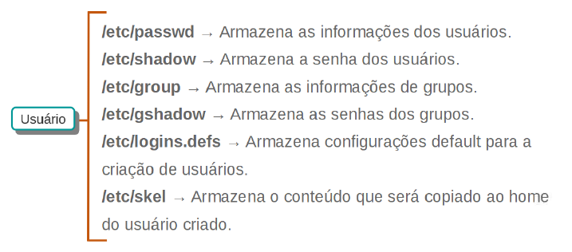
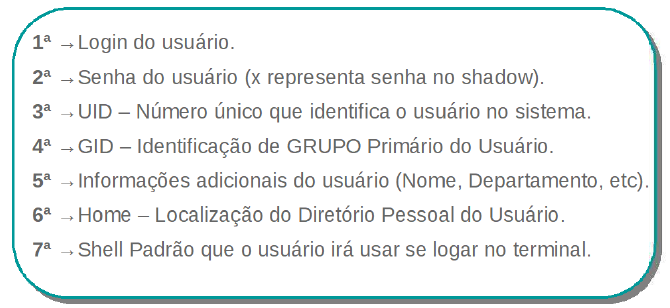
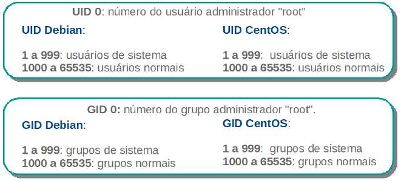
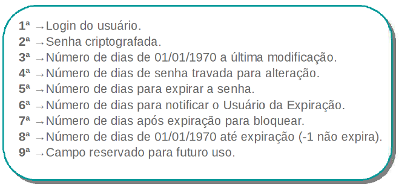

### Aula 04 -  Gerenciamento de Usuários

Ao administrar qualquer sistema de computação, seja em ambientes Windows ou Linux, é primordial saber gerenciar usuários e grupos de usuários.

A partir desse gerenciamento nos tornamos capazes de definir níveis de permissão e diferentes graus de acesso entre usuários e grupos, bem como automatizar ou padronizar a forma como estes usuários e grupos são criados.


#### Aula 4.1 Administrando Usuários

##### Objetivo da aula:
Aprender a criar e manipular configurações de usuários e grupos do sistema, bem como adicionar usuários, grupos e pastas departamentais definindo permissões específicas para seus respectivos usuários e grupos.

###### - Regras que aplicaremos Referente ao Gerenciamento de Usuários:

- **Política de Senha:**
Expirar a cada 30 dias, mínimo 6 caracteres;

- **Pastas Pessoais:**
Armazenar em /srv/homes/
Conter os Diretórios: Documentos, Downloads, Imagens

- **Pastas Departamentais:**
Armazenar em /srv/dexter/

- **Padrão de Nome de Usuários:**
Login do Usuário: nome.sobrenome
Senha Padrão: 4linux


##### Arquitetura de arquivos na criação de um usuário



Dentro de sistemas Linux, temos alguns arquivos que possuem informações específicas sobre diferentes itens relacionados a gerenciamento de usuários, conforme vemos na figura acima.

No entanto, é bom conhecer quais arquivos armazenam quais itens, para facilitar a realização dessas tarefas diárias.


##### Componentes do arquivo /etc/passwd

O arquivo **/etc/passwd** é dividido em campos (separados por **:**). Cada campo do arquivo representa uma configuração diferente relacionado aos usuários, conforme descrito na imagem a seguir.



Os **IDs** de usuários Linux seguem uma regra. Tanto em distribuições **Debian** como em baseadas em **RedHat**, os IDs numerados de **1** a **999**, são usuários de sistema (usuários específicos de aplicações que funcionam dentro do ambiente).

A partir do ID número **1000**, são identificados os IDs usuários comuns do sistema.



##### Componentes do arquivo /etc/shadow



###### Arquivo /etc/shadow

As senhas dos usuários ficam armazenadas no arquivo **“/etc/shadow”** conhecido como “senhas sombras” (shadow passwords). As senhas ficam nele pois é um arquivo mais seguro que o arquivo
**“/etc/passwd”**. No arquivo **“/etc/passwd”** qualquer usuário poderia visualizá-las e copiá-las para outro diretório ou máquina remota, comprometendo a segurança.

Já o arquivo **“/etc/shadow”** tem permissões muito mais restritas, não permitindo que ele seja copiado e nem visualizado diretamente por um usuário comum.

Isso é uma grande ajuda na questão de segurança, pois se as senhas estivessem no próprio **”/etc/passwd”** seria muito fácil para um invasor com usuário comum, copiar esse arquivo para outro servidor e aplicar uma ferramenta de “brute force” para quebrar as senhas.


#### Coletando informaões de usuários existentes
Hora de praticar:

Na máquina **Storage**, vamos executar os comandos a seguir para verificar os arquivos **passwd** e **group** presentes no diretório /etc.

```bash
~ sudo getent passwd
~ sudo getent group
```

Vamos fazer um levantamento de informações sobre o usuário e grupo suporte:
```bash
~ sudo id suporte
~ sudo groups suporte
```

Vamos visualizar as informações do usuário suporte a partir do comando getent:
```bash
~ sudo getent passwd suporte
```

Vamos utilizar o comando **finger** para detalhar informações sobre o usuário suporte:
```bash
~ sudo finger suporte
```

Vamos utilizar também os comandos **who** e **w**, para verificar os usuários que estão conectados:
```bash
~ who
~ w
```

Por fim, vamos verificar as informações do usuário suporte no arquivo **/etc/shadow**:
```bash
~ sudo getent shadow suporte
```


###### Descrição dos comandos

- **sudo** — Permite a usuários comuns obter privilégios de outro usuário, em geral o root;
- **getent passwd** — Lista todos os usuários existentes no sistema;
- **getent group** — Lista todos os grupos existentes no sistema;
- **id** — Verifica o id de um usuário e seus respectivos grupos;
- **groups** — Verifica quais são os grupos aos quais um usuário está vinculado;
- **finger** — Exibe de maneira mais formatada as informações dos usuários;
- **who** — Permite verificar o nome do usuário logado;
- **w** — Verifica todos os usuários logados na máquina.


##### Adicionando usuários no sistema:

Para começar, vamos verificar as opções do comando **adduser** e adicionar o usuário **dexter**:

```bash
~ sudo adduser --help
~ sudo adduser dexter
```

Em seguida vamos adicionar um outro usuário (**bryan.leah**) e também definir a sua respectivas senha:

```bash
~ sudo adduser bryan.leah
~ sudo passwd bryan.leah
```

Vamos verificar se o novo usuário foi criado:

```bash
~ sudo tail -n 2 /etc/passwd /etc/group /etc/shadow
~ ls /home
```

##### Modificar contas de usuários do sistema

Após checar se o usuário **bryan.leah** foi criado, vamos verificar o diretório **/home** do usuário dexter e em seguida vamos modificar algumas configurações.

Vamos definir um novo local para armazenamento dos direorios pessoais dos usuários, conforme:

```bash
~ ls /home
~ ls /srv/homes
```

Como podemos ver, os diretórios pessoais dos usuários foram criados dentro do **/home** e não dentro do **/srv/home**, como definido anteriormente. Vamos alterar esta configuração:


```bash
~ sudo mkdir /srv/homes
~ sudo usermod -m -d /srv/homes/dexter dexter
```

Após alterar a localização do diretório do usuário **dexter**, vamos editar também alterar a localização do diretório pessoal do **bryan.leah**.

```bash
~ sudo usermod -m -d /srv/homes/bryan.leah bryan.leah
```

Vamos checar se os dois usuários possuem uma nova **HOME**:

```bash
~ ls -l /srv/home
~ sudo tail -n 2 /etc/passwd
```

Vamos alterar o nome completo do usuário, e em seguida utilizar o comando getent para verificar se a mudança funcionou:

```bash
~ sudo usermod -c 'Analistas - Infra' suporte
~ sudo getent passwd suporte
```

###### Descrição dos comandos

- **adduser** - Cria usuários no sistema. No Debian por padrão não aceita login com o “.” (ponto),
portanto é preciso usar a opção –force-badname;
- **passwd** - Modifica a senha de um usuários no sistema;
- **usermod** - Altera informações de usuários sem precisar editar arquivos de configuração.
Prefira sempre usá-lo ao invés de editar diretamente o /etc/passwd;
  - Opções do comando usermod:
    - **-m** - Move o conteúdo do diretório pessoal para a nova localização (use somente com -d);
    - **-d** - Novo diretório de login para a nova conta de usuário;
    - **-c** - Altera valores do campo GECOS (campo de comentários sobre usuário);
    -  **-L** - Bloqueia o usuário (lock);
    - **-U** - Desbloqueia o usuário (unlock).


- *Outros comandos para administrar arquivos do sistema*
  - vipw — Edita configurações de usuários diretamente no arquivo /etc/passwd.
  - vipw -s — Edita configurações de senhas dos usuários diretamente no arquivo /etc/shadow.
  - vigr — Edita configurações de grupos dos usuários diretamente no arquivo /etc/group.
  - vigr -s — Edita configurações de senhas de grupos dos usuários diretamente no arquivo
/etc/gshadow.

##### Padronizar pastas para novos Usuários

Para padronizar a estrutura de pastas para novos usuários, precisamos criar a estrutura de pastas desejadas dentro do diretório **/etc/skel**. Este diretório padroniza os conteúdos presentes nas pastas pessoais de usuários recém criados.

Vamos começar listando qual a estrutura de diretórios presentes atualmente nesse diretório:

```bash
~ ls -a /etc/skel
```

Vamos padronizar a criação de três pastas para a criação de novos usuários em nosso sistema:

```bash
~ sudo mkdir /etc/skel/{Documentos,Downloads,Imagens}
~ ls -a /etc/skel
```

Antes de realizar o teste na padronização que definimos, vamos remover o usuário **bryan.leah**
```bash
~ sudo userdel -r bryan.leah
~ ls -l /srv/homes
```

Podemos notar que a pasta do usuário **bryan.leah** não está mais presente no diretório. Vamos adicioná-lo novamente definindo a sua HOME para o diretório **/srv/homes**

```bash
~ sudo adduser --home /srv/homes/bryan.leah bryan.leah
~ sudo passwd bryan.leah
```

Vamos validar as configurações que aplicamos, para isso vamos logar no terminal com a conta do **bryan.leah**:

```bash
~ su - bryan.leah
~ pwd
~ ls
~ exit
```

###### Descrição dos comandos

- **userdel** — Remove a conta de um usuários do sistema.
  - Opções do comando userdel
    - **-r** — Remove o diretório pessoal e spool de mensagens do usuário.
- **su** — O comando su é usado para se tornar outro usuário durante uma sessão de login. Chamado sem um nome de usuário, o su padrão é se tornar o superusuário. A opção “-” fornece um ambiente semelhante ao que o usuário esperaria se o usuário efetuasse login diretamente.

###### **Opções do comando adduser**
- **--home** — Usa um diretório como o diretório home do utilizador. Se o diretório não existir,
ele é criado.

###### Definindo poliíticas de senha para os usuários:

Agora nós verificaremos se a política de senhas atual atende as nossas necessidades. Vamos utilizar o comando **chage** para realizar essa atividade:
```bash
~ sudo chage -l bryan.leah
```

Agora que verificamos que a política de senhas não atendem os padrões que definimos, vamos alterar a política:

```bash
~ sudo chage -M 30 -m 1 bryan.leah
~ sudo chage -l bryan.leah
```

Após alterar a política, vamos checar se conseguiremos alterar a senha. Vamos logar com o usuário **bryan.leah** e tentar alterar a senha:

```bash
~ su - bryan.leah
~ passwd
```

###### Descrição dos comandos

- **chage** — Configura algumas características da senha, como: data de validade, data de aviso
de troca, dentre outras opções do arquivo shadow, fique atento, porque esse comando é muito
útil em seu dia a dia.

###### Opções do comando chage
  - **-l** — Exibe informações sobre idade da conta do usuário;
  - **-M** — Determina o intervalo que a senha irá expirar;
  - **-m** — Determina quantos dias o usuário ficará bloqueado de trocar a senha após uma troca de
senha.


Antes de continuarmos, vamos deslogar da conta **bryan.leah**:

```bash
~ exit
```

Vamos verificar qual a data atual do sistema e alterá-la para outra data:

```bash
~ date
~ sudo date DDMMYYYY
```

###### Descrição do comando
- **date** — Exibe ou define a data e a hora do sistema.

Agora que alteramos a data do sistema, deveremos ser capazes de alterar a senha de **bryan.leah**:

```bash
~ su - bryan.leah
~ passwd
~ exit
```


##### Adicionando usuários via script

Concluímos a política de senha do usuário bryan.leah. Agora vamos adicionar um grupo de usuários a partir de um script. Esse script realizará a criação de vários usuários de uma só vez, eliminando a necessidade de adicionar um a um manualmente.

Ainda na máquina **Storage**, vamos alternar para o usuário **root** e vamos visualizar o script add-**users.sh**:


```bash
~ su -
~ cat /opt/add-users.sh
```

- O script add-user.sh contem o seguinte conteúdo:

```bash
#!/bin/bash
adduser --home /srv/homes/casey.milo casey.milo
echo 'casey.milo:4linux' | chpasswd
adduser --home /srv/homes/annie.dee annie.dee
echo 'annie.dee:4linux' | chpasswd
adduser --home /srv/homes/grace.kenny grace.kenny
echo 'grace.kenny:4linux' | chpasswd
adduser --home /srv/homes/antony.brooks antony.brooks
echo 'antony.brooks:4linux' | chpasswd
adduser --home /srv/homes/fox.bennett fox.bennett
echo 'fox.bennett:4linux' | chpasswd
adduser --home /srv/homes/harry.rosemberg harry.rosemberg
echo 'harry.rosemberg:4linux' | chpasswd
```

O comando **chpasswd** permite definir senha na linha de comando.

Vamos executar o script que realiza a criação de usuários:

```bash
~ bash /opt/add-users.sh
```

Vamos verificar se os usuários realmente foram criados com o comando **getent** e se os diretórios pessoais foram criados dentro do diretório **/srv/homes**

```bash
~ getent passwd
~ ls -l /srv/homes
```

#### Gerenciando pastas

Vamos adicionar quatro grupos no sistema a partir do comando **groupadd**, esses grupos serão relacionados aos departamentos da Dexter:

```bash
~ groupadd diretores
~ groupadd vendedores
~ groupadd financeiro
~ groupadd analistas
```

Vamos verificar se os grupos foram realmente criados:

```bash
~ getent group
~ tail -n 4 /etc/group
```

Descrição dos comandos
- **groupadd** — Cria grupos no sistema. Para remover um grupo use o comando groupdel
*\<nome_do_grupo>*.


Agora que criamos os usuários e os grupos, vamos associar os usuários **bryan.leah** e **casey.milo** ao grupo diretores:

```bash
~ gpasswd -a bryan.leah diretores
~ gpasswd -a casey.milo diretores
```

Vamos executar outro script para adicionar os outros usuários aos grupos que criamos, executando o script **add-to-groups.sh**:

```bash
~ cat /opt/add-to-groups.sh
~ bash /opt/add-to-groups.sh
```

Vamos verificar se os usuários foram devidamente adicionados aos grupos:
```bash
~ getent group
~ tail -n 4 /etc/group
```


#### Aula 4.2 Permissões Especiais


#### Aula 4.3 Configuração do Sudo
