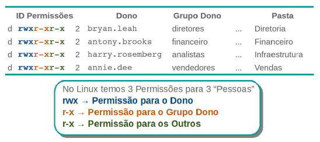
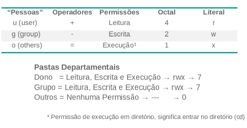
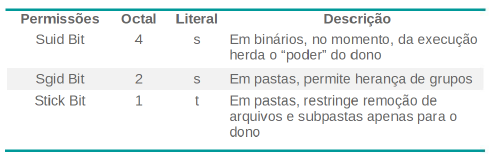

### Aula 04 -  Gerenciamento de Usuários

Ao administrar qualquer sistema de computação, seja em ambientes Windows ou Linux, é primordial saber gerenciar usuários e grupos de usuários.

A partir desse gerenciamento nos tornamos capazes de definir níveis de permissão e diferentes graus de acesso entre usuários e grupos, bem como automatizar ou padronizar a forma como estes usuários e grupos são criados.


#### Aula 4.1 Administrando Usuários

##### Objetivo da aula:
Aprender a criar e manipular configurações de usuários e grupos do sistema, bem como adicionar usuários, grupos e pastas departamentais definindo permissões específicas para seus respectivos usuários e grupos.

###### - Regras que aplicaremos Referente ao Gerenciamento de Usuários:

- **Política de Senha:**
Expirar a cada 30 dias, mínimo 6 caracteres;

- **Pastas Pessoais:**
Armazenar em /srv/homes/
Conter os Diretórios: Documentos, Downloads, Imagens

- **Pastas Departamentais:**
Armazenar em /srv/dexter/

- **Padrão de Nome de Usuários:**
Login do Usuário: nome.sobrenome
Senha Padrão: 4linux


##### Arquitetura de arquivos na criação de um usuário


Dentro de sistemas Linux, temos alguns arquivos que possuem informações específicas sobre diferentes itens relacionados a gerenciamento de usuários, conforme vemos na figura acima.

No entanto, é bom conhecer quais arquivos armazenam quais itens, para facilitar a realização dessas tarefas diárias.


##### Componentes do arquivo /etc/passwd

O arquivo **/etc/passwd** é dividido em campos (separados por **:**). Cada campo do arquivo representa uma configuração diferente relacionado aos usuários, conforme descrito na imagem a seguir.


Os **IDs** de usuários Linux seguem uma regra. Tanto em distribuições **Debian** como em baseadas em **RedHat**, os IDs numerados de **1** a **999**, são usuários de sistema (usuários específicos de aplicações que funcionam dentro do ambiente).

A partir do ID número **1000**, são identificados os IDs usuários comuns do sistema.


##### Componentes do arquivo /etc/shadow


###### Arquivo /etc/shadow

As senhas dos usuários ficam armazenadas no arquivo **“/etc/shadow”** conhecido como “senhas sombras” (shadow passwords). As senhas ficam nele pois é um arquivo mais seguro que o arquivo
**“/etc/passwd”**. No arquivo **“/etc/passwd”** qualquer usuário poderia visualizá-las e copiá-las para outro diretório ou máquina remota, comprometendo a segurança.

Já o arquivo **“/etc/shadow”** tem permissões muito mais restritas, não permitindo que ele seja copiado e nem visualizado diretamente por um usuário comum.

Isso é uma grande ajuda na questão de segurança, pois se as senhas estivessem no próprio **”/etc/passwd”** seria muito fácil para um invasor com usuário comum, copiar esse arquivo para outro servidor e aplicar uma ferramenta de “brute force” para quebrar as senhas.


#### Coletando informaões de usuários existentes
Hora de praticar:

Na máquina **Storage**, vamos executar os comandos a seguir para verificar os arquivos **passwd** e **group** presentes no diretório /etc.

```bash
~ sudo getent passwd
~ sudo getent group
```

Vamos fazer um levantamento de informações sobre o usuário e grupo suporte:
```bash
~ sudo id suporte
~ sudo groups suporte
```

Vamos visualizar as informações do usuário suporte a partir do comando getent:
```bash
~ sudo getent passwd suporte
```

Vamos utilizar o comando **finger** para detalhar informações sobre o usuário suporte:
```bash
~ sudo finger suporte
```

Vamos utilizar também os comandos **who** e **w**, para verificar os usuários que estão conectados:
```bash
~ who
~ w
```

Por fim, vamos verificar as informações do usuário suporte no arquivo **/etc/shadow**:
```bash
~ sudo getent shadow suporte
```


###### Descrição dos comandos

- **sudo** — Permite a usuários comuns obter privilégios de outro usuário, em geral o root;
- **getent passwd** — Lista todos os usuários existentes no sistema;
- **getent group** — Lista todos os grupos existentes no sistema;
- **id** — Verifica o id de um usuário e seus respectivos grupos;
- **groups** — Verifica quais são os grupos aos quais um usuário está vinculado;
- **finger** — Exibe de maneira mais formatada as informações dos usuários;
- **who** — Permite verificar o nome do usuário logado;
- **w** — Verifica todos os usuários logados na máquina.


##### Adicionando usuários no sistema:

Para começar, vamos verificar as opções do comando **adduser** e adicionar o usuário **dexter**:

```bash
~ sudo adduser --help
~ sudo adduser dexter
```

Em seguida vamos adicionar um outro usuário (**bryan.leah**) e também definir a sua respectivas senha:

```bash
~ sudo adduser bryan.leah
~ sudo passwd bryan.leah
```

Vamos verificar se o novo usuário foi criado:

```bash
~ sudo tail -n 2 /etc/passwd /etc/group /etc/shadow
~ ls /home
```

##### Modificar contas de usuários do sistema

Após checar se o usuário **bryan.leah** foi criado, vamos verificar o diretório **/home** do usuário dexter e em seguida vamos modificar algumas configurações.

Vamos definir um novo local para armazenamento dos direorios pessoais dos usuários, conforme:

```bash
~ ls /home
~ ls /srv/homes
```

Como podemos ver, os diretórios pessoais dos usuários foram criados dentro do **/home** e não dentro do **/srv/home**, como definido anteriormente. Vamos alterar esta configuração:


```bash
~ sudo mkdir /srv/homes
~ sudo usermod -m -d /srv/homes/dexter dexter
```

Após alterar a localização do diretório do usuário **dexter**, vamos editar também alterar a localização do diretório pessoal do **bryan.leah**.

```bash
~ sudo usermod -m -d /srv/homes/bryan.leah bryan.leah
```

Vamos checar se os dois usuários possuem uma nova **HOME**:

```bash
~ ls -l /srv/home
~ sudo tail -n 2 /etc/passwd
```

Vamos alterar o nome completo do usuário, e em seguida utilizar o comando getent para verificar se a mudança funcionou:

```bash
~ sudo usermod -c 'Analistas - Infra' suporte
~ sudo getent passwd suporte
```

###### Descrição dos comandos

- **adduser** - Cria usuários no sistema. No Debian por padrão não aceita login com o “.” (ponto),
portanto é preciso usar a opção –force-badname;
- **passwd** - Modifica a senha de um usuários no sistema;
- **usermod** - Altera informações de usuários sem precisar editar arquivos de configuração.
Prefira sempre usá-lo ao invés de editar diretamente o /etc/passwd;
  - Opções do comando usermod:
    - **-m** - Move o conteúdo do diretório pessoal para a nova localização (use somente com -d);
    - **-d** - Novo diretório de login para a nova conta de usuário;
    - **-c** - Altera valores do campo GECOS (campo de comentários sobre usuário);
    -  **-L** - Bloqueia o usuário (lock);
    - **-U** - Desbloqueia o usuário (unlock).


- *Outros comandos para administrar arquivos do sistema*
  - vipw — Edita configurações de usuários diretamente no arquivo /etc/passwd.
  - vipw -s — Edita configurações de senhas dos usuários diretamente no arquivo /etc/shadow.
  - vigr — Edita configurações de grupos dos usuários diretamente no arquivo /etc/group.
  - vigr -s — Edita configurações de senhas de grupos dos usuários diretamente no arquivo
/etc/gshadow.

##### Padronizar pastas para novos Usuários

Para padronizar a estrutura de pastas para novos usuários, precisamos criar a estrutura de pastas desejadas dentro do diretório **/etc/skel**. Este diretório padroniza os conteúdos presentes nas pastas pessoais de usuários recém criados.

Vamos começar listando qual a estrutura de diretórios presentes atualmente nesse diretório:

```bash
~ ls -a /etc/skel
```

Vamos padronizar a criação de três pastas para a criação de novos usuários em nosso sistema:

```bash
~ sudo mkdir /etc/skel/{Documentos,Downloads,Imagens}
~ ls -a /etc/skel
```

Antes de realizar o teste na padronização que definimos, vamos remover o usuário **bryan.leah**
```bash
~ sudo userdel -r bryan.leah
~ ls -l /srv/homes
```

Podemos notar que a pasta do usuário **bryan.leah** não está mais presente no diretório. Vamos adicioná-lo novamente definindo a sua HOME para o diretório **/srv/homes**

```bash
~ sudo adduser --home /srv/homes/bryan.leah bryan.leah
~ sudo passwd bryan.leah
```

Vamos validar as configurações que aplicamos, para isso vamos logar no terminal com a conta do **bryan.leah**:

```bash
~ su - bryan.leah
~ pwd
~ ls
~ exit
```

###### Descrição dos comandos

- **userdel** — Remove a conta de um usuários do sistema.
  - Opções do comando userdel
    - **-r** — Remove o diretório pessoal e spool de mensagens do usuário.
- **su** — O comando su é usado para se tornar outro usuário durante uma sessão de login. Chamado sem um nome de usuário, o su padrão é se tornar o superusuário. A opção “-” fornece um ambiente semelhante ao que o usuário esperaria se o usuário efetuasse login diretamente.

###### **Opções do comando adduser**
- **--home** — Usa um diretório como o diretório home do utilizador. Se o diretório não existir,
ele é criado.

###### Definindo poliíticas de senha para os usuários:

Agora nós verificaremos se a política de senhas atual atende as nossas necessidades. Vamos utilizar o comando **chage** para realizar essa atividade:
```bash
~ sudo chage -l bryan.leah
```

Agora que verificamos que a política de senhas não atendem os padrões que definimos, vamos alterar a política:

```bash
~ sudo chage -M 30 -m 1 bryan.leah
~ sudo chage -l bryan.leah
```

Após alterar a política, vamos checar se conseguiremos alterar a senha. Vamos logar com o usuário **bryan.leah** e tentar alterar a senha:

```bash
~ su - bryan.leah
~ passwd
```

###### Descrição dos comandos

- **chage** — Configura algumas características da senha, como: data de validade, data de aviso
de troca, dentre outras opções do arquivo shadow, fique atento, porque esse comando é muito
útil em seu dia a dia.

###### Opções do comando chage
  - **-l** — Exibe informações sobre idade da conta do usuário;
  - **-M** — Determina o intervalo que a senha irá expirar;
  - **-m** — Determina quantos dias o usuário ficará bloqueado de trocar a senha após uma troca de
senha.


Antes de continuarmos, vamos deslogar da conta **bryan.leah**:

```bash
~ exit
```

Vamos verificar qual a data atual do sistema e alterá-la para outra data:

```bash
~ date
~ sudo date DDMMYYYY
```

###### Descrição do comando
- **date** — Exibe ou define a data e a hora do sistema.

Agora que alteramos a data do sistema, deveremos ser capazes de alterar a senha de **bryan.leah**:

```bash
~ su - bryan.leah
~ passwd
~ exit
```


##### Adicionando usuários via script

Concluímos a política de senha do usuário bryan.leah. Agora vamos adicionar um grupo de usuários a partir de um script. Esse script realizará a criação de vários usuários de uma só vez, eliminando a necessidade de adicionar um a um manualmente.

Ainda na máquina **Storage**, vamos alternar para o usuário **root** e vamos visualizar o script add-**users.sh**:


```bash
~ su -
~ cat /opt/add-users.sh
```

- O script add-user.sh contem o seguinte conteúdo:

```bash
#!/bin/bash
adduser --home /srv/homes/casey.milo casey.milo
echo 'casey.milo:4linux' | chpasswd
adduser --home /srv/homes/annie.dee annie.dee
echo 'annie.dee:4linux' | chpasswd
adduser --home /srv/homes/grace.kenny grace.kenny
echo 'grace.kenny:4linux' | chpasswd
adduser --home /srv/homes/antony.brooks antony.brooks
echo 'antony.brooks:4linux' | chpasswd
adduser --home /srv/homes/fox.bennett fox.bennett
echo 'fox.bennett:4linux' | chpasswd
adduser --home /srv/homes/harry.rosemberg harry.rosemberg
echo 'harry.rosemberg:4linux' | chpasswd
```

O comando **chpasswd** permite definir senha na linha de comando.

Vamos executar o script que realiza a criação de usuários:

```bash
~ bash /opt/add-users.sh
```

Vamos verificar se os usuários realmente foram criados com o comando **getent** e se os diretórios pessoais foram criados dentro do diretório **/srv/homes**

```bash
~ getent passwd
~ ls -l /srv/homes
```

#### Gerenciando pastas

Vamos adicionar quatro grupos no sistema a partir do comando **groupadd**, esses grupos serão relacionados aos departamentos da Dexter:

```bash
~ groupadd diretores
~ groupadd vendedores
~ groupadd financeiro
~ groupadd analistas
```

Vamos verificar se os grupos foram realmente criados:

```bash
~ getent group
~ tail -n 4 /etc/group
```

Descrição dos comandos
- **groupadd** — Cria grupos no sistema. Para remover um grupo use o comando groupdel
*\<nome_do_grupo>*.


Agora que criamos os usuários e os grupos, vamos associar os usuários **bryan.leah** e **casey.milo** ao grupo diretores:

```bash
~ gpasswd -a bryan.leah diretores
~ gpasswd -a casey.milo diretores
```

Vamos executar outro script para adicionar os outros usuários aos grupos que criamos, executando o script **add-to-groups.sh**:

```bash
~ cat /opt/add-to-groups.sh
~ bash /opt/add-to-groups.sh
```

Vamos verificar se os usuários foram devidamente adicionados aos grupos:
```bash
~ getent group
~ tail -n 4 /etc/group
```


#### Aula 4.2 Permissões Especiais

##### Objetivos da Aula

Nesta aula, realizaremos a alteração de donos e grupos de arquivos e diretórios, bem como gerenciar permissões no sistema (literais e octais) e gerenciar permissões especiais.

##### Gerenciando permissões de Pastas

Vamos logar na máquina **Storage** com o usuário suporte e alternar para o usuário root:

```bash
~ su -
```

Vamos criar o diretório base para as pastas departamentais da empresa e em seguida acessá-la:

```bash
~ mkdir /srv/dexter
~ cd /srv/dexter
```

Vamos criar uma pasta para cada departamento da organização:

```bash
~ mkdir {Diretoria,Vendas,Financeiro,Infra}
~ ls -l
```

Vamos alterar os donos e grupos dos diretórios a partir dos comandos **chown** e **chgrp**:

```bash
~ chown bryan.leah Diretoria
~ chown annie.dee Vendas
~ chown antony.brooks Financeiro
~ chown harry.rosemberg Infra
```

```bash
~ chgrp diretores Diretoria
~ chgrp vendedores Vendas
~ chgrp financeiro Financeiro
~ chgrp analistas Infra
~ ls -l
```

###### Descrição dos comandos
- **chown** — Permite alterar o dono de pastas e arquivos.
- **chgrp** — Permite alterar o grupo dono de pastas e arquivos.

##### Regras relacionadas ao Gerenciamento de arquivos que vamos definir:

- Todo o departamento tem acesso de Leitura e Escrita em sua pasta;
- Um departamento não pode acessar a pasta de outro departamento (mesmo que seja para leitura);
- Todos os arquivos criados na pasta do departamento, precisam ser do grupo correspondente a este departamento;
- Um usuário não pode apagar arquivos dentro da pasta do departamento, a não ser que ele seja o **DONO** do arquivo ou da pasta departamental;
- O presidente da empresa acessa todas as pastas de todos os departamentos.

##### Permissões no Linux



###### Entendendo as permissões
Ao utilizar o comando ls com o parâmetro menos “-l” uma listagem longa é exibida, nesta listagem o
primeiro caractere pode ser:

- "**-**" →indicando a listagem de um arquivo comum”;
- **d** → indicando um diretório;
- **l** → indicando um “link” simbólico;
- **p** → indicando um “pipe” nomeado;
- **s** → indicando um “socket”;
- **c** → indicando um dispositivo de caractere;
- **b** → indicando um dispositivo de bloco.

Após o primeiro carácter os próximos três conjuntos de três caracteres indicam as permissões do
usuário dono do arquivo, permissões de grupo e permissões para outros usuários.
Nesses três conjuntos, se o caractere encontrado for um **“-”** (hífen) significa que a permissão está
ausente, ou seja, não há a respectiva permissão. Se alguma ou todas as letras (r, w e x) forem
encontradas, indicará as permissões que o arquivo tem permissões definidas conforme a tabela do
slide acima.




###### Testando as permissões no 4linux

Vamos logar com o usuário fox.bennett (do grupo financeiro), e tentar acessar a pasta de outro departamento:

```bash
~ su - fox.bennett
~ cd /srv/dexter/Vendas
~ pwd
```

Agora, vamos acessar a pasta do departamento Financeiro e tentar criar um arquivo na pasta do departamento de fox.bennett:

```bash
~ cd /srv/dexter/Financeiro
~ touch relatorio.txt
touch: cannot touch 'relatorio.txt': Permission denied
~ exit
```

###### Descrição dos problemas
- 1° Problema:
  O funcionário consegue entrar em pastas de departamentos que ele não pertence.
- 2° Problema:
  O funcionário do departamento está sem acesso a criar arquivos.


#### Resolvendo os problemas de permissão

Vamos acessar a pasta base dos departamentos da empresa e verificar as permissões dos departamentos:

```bash
~ cd /srv/dexter
~ ls -l
```
A seguir, vamos alterar as permissões das pastas a partir do comando **chmod**:

```bash
~ chmod u=rwx,g=rwx,o= Diretoria
~ chmod g+w, o=rx Financeiro
~ chmod ug=rwx,o= Infra
~ chmod 770 Vendas
~ ls -l
```

###### Descrição dos comandos
- **chmod** — Permite alterar as permissões do dono, grupo e outros de pastas e arquivos. Ele
pode ser usado de forma literal ou octal.
  - **r** →  4  →  Leitura;
  - **w**  →  2  →  Escrita;
  - **x**  →  1  →  Execução um pacote.

###### Descrição das permissões
- **u=rwx,g=rwx,o=** — O usuário e grupo tem permissão igual(=) a leitura(r), escrita(w) e
  execução(x). Outros não possui nenhuma permissão.
- **g+w,o-rx** — O grupo ganha(+) permissão de escrita(w). Outros perde(-) permissão de leitura(r)
  e execução(x).
- **ug=rwx,o=** — O usuário e grupo tem permissão igual(=) a leitura(r), escrita(w) e execução(x).
  Outros não possui nenhuma permissão.


###### Entendendo as permissões
Seguindo o conjunto de permissões, há um número que indica a quantidade de “links” simbólicos que o arquivo ou diretório tem. Após o número de “links”, vem a indicação do usuário dono do arquivo, seguido do grupo ao qual ele, o arquivo ou diretório, pertence.

Vamos checar se as alterações que aplicamos surtiram efeito, com o usuário fox.bennett, vamos tentar acessar o diretório de outro departamento:

```bash
~ su - fox.bennett
~ cd /srv/dexter/Vendas
-bash: cd: /srv/dexter/Vendas: Permission denied
```
Agora vamos tentar criar um arquivo dentro da pasta do Financeiro (grupo de fox.bennett):

```bash
~ cd /srv/dexter/Financeiro
~ touch relatorio.txt
~ ls -l
~ exit
```

###### Resolução dos problemas
- **1° Problema** - OK
O funcionário não acessa demais departamentos.
- **2° Problema** - OK
O funcionário do Departamento consegue criar arquivos.

##### Atribuindo Permissões:
Os parâmetros “u-rwx,g=rwx,o=” utilizados anteriormente definiram o esquema de permissões. A primeira letra indica para qual(is) usuário(s) as permissões estão sendo alteradas. Usamos a letra “u” para indicar o próprio dono, “g” para indicar o grupo, “o” para outros e ainda a letra “a” para indicar todos.

O caractere seguinte poderia ser um sinal de “=” para definir uma permissão “+” para adicionar
valores a permissão ou “-” para retirar valores da permissão.

##### Testando permissões no Linux - Parte 2

Vamos logar com o usuário **antony.brooks** e tentar realizar alterações no arquivo **relatorio.txt**:

```bash
~ su - antony.brooks
~ cd /srv/dexter/Financeiro
~ echo "Revisão" >> relatorio.txt
-bash: relatorio.txt: Permission denied
```

- **3° Problema**:
Funcionários do mesmo Departamento estão sem acesso aos arquivos dos colegas.

Antes de resolver o problema que acabamos de notar, vamos aprender um pouco sobre o comando **umask**:

```bash
~ umask
~ touch teste.txt
~ mkdir pasta
~ ls -l
```

###### Resumo das Permissões no padrão Octal
A sintaxe utilizada no momento em que definimos a permissão para o diretório **Vendas** utiliza o formato octal. Neste caso, o parâmetro que define as permissões é composto de três números de 0 a 7, que correspondem às permissões para o usuário dono, para o grupo e para outros. Cada número é formado pela soma das permissões atribuídas, sendo que execução vale 1, escrita vale 2 e leitura 4.

Vamos alterar o valor do **umask** e a seguir criar um novo arquivo e um novo diretório para validar a alteração realizada.

```bash
~ umask 007
~ touch teste2.txt
~ mkdir pasta2
```
Vamos listar as permissões de forma literal e em seguida retornar ao usuário root:

```bash
~ ls -l
~ exit
```

###### Cálculo de UMASK para diretórios
O “umask” altera o valor da máscara de criação de arquivos e diretórios. Essa “más- cara” é utilizada para definir o “permissionamento” padrão de um arquivo ou diretório quando ele é criado.

- Cálculo da umask do Diretório:
Para calcular a “umask” para um diretório, pegue a permissão total que um diretório pode chegar, “777” e em seguida subtraia “a sua umask atual”.

  - Exemplo: Considere um umask com valor 022

Primeiro pegamos a permissão máxima para um diretório que é 777 e subtraimos do valor da
umask atual que é: 022

Logo: **777** – **022** = **755** → Este valor é a permissão do diretório a ser criado;


###### Regra UMASK

Descrição       | Valor Octal
----------------|---------
Permissão Total | 777
(-) UMASK           | - 0022
Permissão padrão de diretório |  755
(-) Permissão de execução de arquivos | - 111
Permissão padrão de arquivos |  644

###### Definindo permissões de UMASK de maneira persistente

Para padronizarmos o valor de **umask** para um usuário, devemos definir este padrão de configuração dentro do arquivo **.bashrc** presente dentro do HOME deste usuário, conforme abaixo:

```bash
~ vim /srv/homes/antony.brooks/.bashrc +$
~ .......
~ umask 007
```

Para fixarmos o valor de umask automaticamente na criação de novos usuários, devemos atribuir o valor de umask desejado no arquivo **.bashrc** presente no diretório **/etc/skel**:

```bash
~ vim /etc/skel/.bashrc +$
~ .......
~ umask 007
```

###### Cálculo de umask para arquivos
Para calcular a “umask” para um arquivo, saiba que um arquivo não pode ser criado com permissão de execução, por padrão, esta permissão só pode ser passada para ele manualmente.

Logo a permissão do arquivo não pode ser ímpar, porque o bit de execução vale 1.
Exemplo: Vamos considerar a mesma umask do exemplo anterior, 022

Primeiro pegamos a permissão máxima posśivel que é 777 e subtraímos do valor da umask atual que é: 022

Logo: **777** – **022** = **755** → Este valor é a permissão calculado mas lembre-se:
Não podemos ter permissão de execução sobre os arquivos, sendo o valor da permissão de execução igual a 1.
A partir disso, subtraia 1 dos bits que sejam ímpares:

755 – 011 = 644 → Retirando os bits de execução temos 644 que é a permissão real do arquivo.

Regra do laboratório | valor
------|------
Permissão Total | 777
Permissão Padrão Diretório | 770
UMASK | 007


Conhecendo o conceito, vamos agora utilizar o script **copy-umask.sh** para padronizar o valor de umask de todos os usuários:

```bash
~ cat /opt/copy-umask.sh
~ bash /opt/copy-umask.sh
```

Em seguida, acessaremos o terminal como **casey.milo** para confirmar as alterações de umask:

```bash
~ su - casey.milo
~ umask
~ exit
```
###### Resolução dos problemas
No cenário da Dexter, os funcionários deveriam estar gravando pastas com permissão 770 (rwxrwx---) e arquivos com permissão 660 (rw-rw----).

###### Shell Script copy-umask.sh
O script copy-umask.sh contem o seguinte conteúdo:
```bash
#!/bin/bash
for FUNCIONARIO in $(ls /srv/homes/)
do
cp -v /etc/skel/.bashrc /srv/homes/$FUNCIONARIO/
done
```

##### Permissões especiais




No cenário que estamos simulando, todos os arquivos presentes na pasta do departamento, devem ser do mesmo **grupo** do departamento.


Vamos acessar a pasta base dos departamentos da empresa e verificar as permissões vigentes:

```bash
~ cd /srv/dexter
~ ls -l
```

Vamos utilizar o comando **chmod** para permitir a herança de permissões de grupos:

```bash
~ chmod g+s Diretoria
~ chmod 2770 Financeiro Infra Vendas
~ ls -l /srv/dexter/
```

###### Aplicar herança de grupos nas pastas
O “SGID bit” é geralmente atribuível a diretórios. Quando um arquivo é criado dentro de um diretório com “SGID bit” ativado, o conteúdo gravado dentro do diretório irá herdar o grupo do diretório e não o grupo do usuário que criou tal conteúdo.

Este “bit” especial é muito útil quando utilizamos diretórios para grupos de trabalhos e em servidores de arquivos.

##### Validando o acesso a arquivos e diretórios

Vamos validar os ajustes com o usuário fox.bennett, no acesso a pasta Vendas:

```bash
~ rm -rf /srv/dexter/Financeiro/*
~ su - fox.bennett
~ cd /srv/dexter/Vendas
~ -bash: cd: /srv/dexter/Vendas: Permission denied
```

Na pasta do setor Financeiro, vamos criar o arquivo **relatorio.txt** e verificar as permissões de grupo:

```bash
~ cd /srv/dexter/Financeiro
~ touch relatorio.txt
~ ls -l
~ exit
```

###### O SUID e o SGID bit
O “bit” especial para o campo de permissões do dono é o “SUID” representado por “s” ou “S”. Para o grupo é “SGID” também representado por “s” ou “S”.

Veja que quando o arquivo ou diretório não tem permissão de execução, o “bit” especial é representado por uma letra “S” (Upper Case), e quando possuem uma permissão de execução, o “bit” especial é apresentado como “s” (Lower Case). O mesmo acontece com o “Sticky bit” que veremos a seguir.

###### Stick bit
O “Sticky bit” era bastante utilizado para realizar otimizações de acesso a conteúdos, entretanto, a partir da série 2.6 do kernel do Linux essa tarefa é realizada diretamente pelo kernel. A única utilidade desse “bit”, atualmente, é fazer diretórios de utilização comum a todos os usuários, como no “/tmp”.

Quando esse “bit” está ativo em um diretório, todo conteúdo criado dentro dele pertencerá ao criador do conteúdo e por mais que ele atribua a esse conteúdo permissões totais para todos os usuários, o único que poderá excluir o arquivo ou diretório será o próprio dono ou o “root” ou ainda o dono do diretório que tem a permissão.

Vamos logar com outro usuário do grupo financeiro e acessar a pasta do seu departamento:

```bash
~ su - antony.brooks
~ cd /srv/dexter/Financeiro
```

Vamos checar se o terceiro problema foi resolvido:

```bash
~ echo "Revisão" >> relatorio.txt
~ mkdir 2019
~ ls -l
~ exit
```


##### Restringindo a remoção de arquivos e diretórios

Através das permissões especiais **SGID BIT** e **STICK BIT**, vamos fazer as alterações seguintes:

```bash
~ cd /srv/dexter
~ chmod o+t Diretoria
~ chmod 3770 Financeiro #(2 SGID Bit + 1 STICK Bit)
~ chmod 3770 Vendas Infra
~ ls -l
```

Vamos logar com o usuário fox.bennett e validar a restrição para remoção de arquivos e diretórios:

```bash
~ su - fox.bennett
~ cd /srv/dexter/Financeiro
~ rm -rf 2019
(rm: cannot remove '2019': Operation not permitted)
```

#### Aula 4.3 Configuração do Sudo

##### Objetivos da aula

Introdução ao **SUDO** e suas configurações, permitindo que os usuários comuns do sistema executem tarefas específicas de maneira segura.

##### Introdução

- **Sudo**: forma abreviada relacionada a *substitute user (fazer substituição do usuário) ou super user (fazer como super usuário)*;
- Comando originário do Sistema Operacional Unix;
- Permite a usuários comuns obter privilégios de outro usuário;
- Privilégios de super usuário permitem executar tarefas específicas no sistema de maneira segura e controlável pelo administrador.

O comando sudo do sistema operacional Unix permite a usuários comuns obter privilégios de outro usuário, em geral o super usuário, para executar tarefas específicas dentro do sistema de maneira segura e controlável pelo administrador.

O nome é uma forma abreviada de se referir a substitute user do (fazer substituição do usuário) ou
super user do (fazer como super usuário).

##### Analisar configuração de Sudo

Vamos logar com o usuário **suporte** e mudar para o usuário **root**:

```bash
~ su -
```

Vamos visualizar as configurações de SUDO sem as linhas comentadas e vazias:

```bash
~ egrep -V '^#|^$' /etc/sudoers
```

######Componentes do sudoers

- **Defaults** — Define variáveis de ambiente.
Exemplo: Defaults env_reset
- **User_Aliases** — Define uma alias para usuários que ganham privilégios de root.
Exemplo: User_Alias ADMINS = jsmith, mikem
- **Host_Aliases** — Define uma alias para grupos de máquinas ou para host específico.
Exemplo: Host_Alias SERVERS = 192.168.0.1, 192.168.0.2, server1
- **Cmnd_Alias** — Define alias para grupos de comandos ou para um comando específico.
Exemplo: Cmnd_Alias WEB_CMDS = /etc/init.d/apache2

##### Configurar opções de SUDO
Para alterar as configurações de **SUDO**, devemos executar o comando **visudo**:

```bash
~ visudo
....
User_Alias DEXTER = casey.milo
Cmnd_Alias PACKAGES = /bin/rpm, /usr/bin/yum
DEXTER ALL = PACKAGES
```

Vamos alterar para o usuário **casey.milo** e testar as ferramentas **yum** e **rpm**, para validar as configurações de SUDO:

```bash
~ su - casey.milo
~ sudo yum search httpd
~ sudo rpm -qa
```

Vamos testar agora a configuração de outros comandos que não constam na configuração do **SUDO**:

```bash
~ sudo ifconfig
[sudo] senha para casey.milo:
casey.milo não tem permissão para executar sudo em storage.
Este incidente será relatado.
~ exit
```

Vamos editar o SUDO novamente, permitindo a execução de comandos sem uso de senha:

```bash
~ visudo
....
DEXTER ALL = (root) NOPASSWD: PACKAGES
```
###### Descrição dos comandos
- **visudo** — Edita o arquivo /etc/sudoers e permite que o root altere o seu conteúdo. Nenhuma verificação de consistência é feita pelo comando;
- **NOPASSWD** — Por padrão, o sudo exige que um usuário se autentique antes de executar um comando. Esse comportamento pode ser modificado por meio da tag NOPASSWD.

Vamos alternar para o usuário **casey.milo** novamente e testar o uso do **ifconfig** novamente:

```bash
~ sudo ifconfig
```

Vamos editar novamente a configuração do SUDO permitindo a execução de comandos sem uso de senha para todos os usuários que façam parte do grupo **Financeiro**:

```bash
~ visudo
....
%financeiro ALL = (root) NOPASSWD: PACKAGES
```

###### Descrição dos comandos
Um **User_List** é composto de um ou mais nomes de usuário, IDs de usuários (prefixados com '#'), nomes de grupos de sistemas e IDs (prefixados com '%' e '% #' respectivamente), netgroups (prefixados com '+'), nomes e IDs de grupos não-Unix (prefixados com '%:' e '%: #', respectivamente) e **User_Aliases**.

Vamos validar se a configuração aplicada surtiu efeito, vamos logar com o usuário **fox.bennett** e testar as ferramentas **yum** e **rpm**:

```bash
~ su - fox.bennett
~ sudo rpm -qa
~ exit
```

### LAB GAMIFICATION 5

1 - Adicionar o usuário devops.
2 - Adicionar o grupo ti.
3 - Alterar o grupo primário do usuário suporte para o grupo ti
4 - Alterar o shell do usuário devops para /bin/sh.
5 - Liste de forma adiministrativa todos os usuários.
6 - Liste de forma administrativa todos os grupos.
7 - Executar o comando para trocar a senha do usuário devops.
8 - Trocar o grupo do arquivo /opt/pacotes/htop.rpm
9 - Trocar o usuário dono do arquivo /opt/pacotes/htop.rpm
10 - Definir que o dono, grupo e outros possam ler e escrever o arquivo /opt/pacotes/htop.rpm
