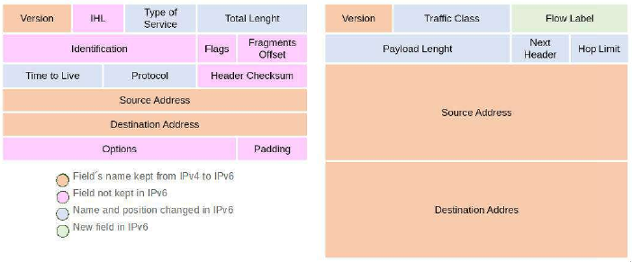
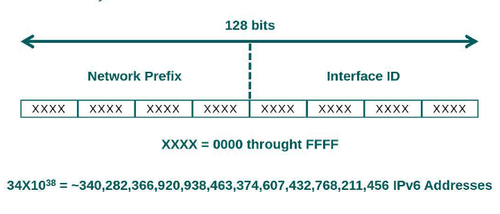

### Aula 06

#### 6.1 Fundamentos de Redes

##### Componentes da Rede

- **"Endereço IP"**: Identificação única de um computador na rede em que ele se encontra;
- **"Máscara de rede"**: Parâmetro que determina a quantidade de hosts que a rede pode ter;

####### Classes de endereçamento IP
  - Classe A = 255.0.0.0 (/8);
  - Classe B = 255.255.0.0 (/16);
  - Classe C = 255.255.255.0 (/24);

- **"Rede/Network"**: O endereço de rede propriamente dito, também conhecido como network, é sempre o primeiro IP da rede;
- **"Broadcast"**: Também é um endereço IP (mas é sempre o último possível dentro da rede ou subrede), permite que a informação seja enviada para todas as máquinas;
- **"Gateway"**: É o componente de rede que serve como "fronteira" para outra rede. Seu papel é encaminhar os pacotes TCP/IP dos hosts internos de uma rede para outras redes TCP/IP;
- **"Loopback/Lo"**: Consiste em uma interface interna do host. Possui o endereço 127.0.0.1 reservado, é utilizado basicamente para comunicação interna de aplicações.

## ATENÇÃO

Ao utilizar servidores em Cloud, é muito comum as configurações de rede serem realizadas a partir do console de gerenciamento do servidor e não mais nos arquivos de configuração utilizados costumeiramente no Sistema Operacional.


Vamos logar com o usuário **suporte** na máquina **Security**, e em seguida listar as interfaces de rede disponíveis:

```bash
~$ sudo ifconfig -a
```

Em seguidas vamos verificar a conectividade física da interface com o comando **mii-tool**:

```bash
~$ sudo mii-tool enp0s3
```

Para verificar o roteador padrão, executamos o comando **route**:

```bash
~$ sudo route -n
```

##### Descrição dos comandos:

- **ifconfig** - É utilizado para configurar (e posteriormente manter) as interfaces de rede. Utilizado durante o boot para configurar as interfaces do servidor para um estado usável;
- **mii-tool** - Verifica ou define o status da interface de rede, a maioria dos adaptadores ethernet utiliza uma mii para autonegocia a velocidade do link e a configuração do duplex (half/full);
- **route**: Permite gerenciar configurações de rotas do sistema.

###### Opções do comando ifconfig
- **-a** - Exibe informações de todas as interfaces de rede ativas ou inativas no servidor.

###### Opções do comando route
- **-n** - Mostra as rotas definidas atualmente, sem resolver nomes.


Vamos verificar o nome da máquina utilizando o comando **hostname**:

```bash
~$ hostname
```

Para verificar os servidores DNS configurados na máquina, basta checarmos o arquivo **/etc/resolv.conf**:

```bash
~$ sudo cat /etc/resolv.conf
```
Temos também a opção de checar a resolução de nomes local, no arquivo **/etc/hosts**:


```bash
~$ sudo cat /etc/hosts
```

##### Descrição dos comandos:

- **Hostname** - Capaz de exibir ou alterar o hostname do computador;


###### Arquivo /etc/resolv.conf

O arquivo **/etc/resolv.conf** é o arquivo de configuração principal do para definirmos um resolvedor de nomes. O formato é de texto simples com um parâmetro por linha, é onde definimos o endereços dos servidores DNS. Existem três palavras chave utilizadas na configuração:

- **domain** - Especifica o nome do domínio local;
- **search** - Define uma lista de nomes de domínio alternativos ao procurar por um computador, os nomes são separados por espaçoes. A linha de search pode ter no máximo 6 domínios ou 256 caracteres;
- **nameserver** - Especifica o endereço IP de um servidor de nomes. Pode ser utilizado várias vezes.


###### Arquivo /etc/hosts

O arquivo **/etc/hosts** faz o relacionamento entre um hostname e um endereço IP local. Recomendado para IPs que são acessados com frequência os quais podem eventualmente não estar cadastrados num servidor DNS.


Vamos agora checar as informações de rede do servidor **Storage**, utilizando o usuário **suporte**:

```bash
~$ sudo ip a
```
Em seguida vamos checar a conectividade física da interface, executando o comando **ethtool**:

```bash
~$ sudo ethtool enp0s3
```

Vamos verificar também o roteador padrão executando o comando **route**:

```bash
~$ sudo ip route show
```

###### Descrição dos comandos

- **ip** - Permite exibir e manipular configurações da interface de rede, como roteamento, túneis, políticas, etc;
  - **-a** - Exibe endereços IP das interfaces de rede;
  - **route show** - Exibe as rotas definidas atualmente (Tabela de Roteamento);
- **ethtool** - Verifica ou define o status da interface de rede, assim como o comando **mii-tool** que vimos anteriormente.

Ao continbuarmos obtendo informações sobre a rede no CentOS/RedHat, vamos utilizar novamente o comando **hostname**:

```bash
~$ hostname
```

Para verificar as configurações de resoluções de nome, devemos acessar os arquivos **/etc/resolv.conf** e **/etc/hosts**, assim como em distribuições **Debian**:

```bash
~$ sudo cat /etc/resolv.conf
```

```bash
~$ sudo cat /etc/hosts
```

#### 6.2 Administrando a Rede

##### Introdução

**Explorando o comando IP**

O comando **ip** é uma ferramenta extremamente poderosa. Com ele podemos alterar a maioria das configurações relacionadas a rede (alterar configurações de interfaces, utilização de arp, políticas de roteamento, túneis de VPN, etc).


###### Configuração de rede no CentOS/RedHat

**nmtui**

O nmtui (interface de usuário do Network Manager Text) é um programa de linha de comando
disponível no RHEL/CentOS 7 para configuração de endereço IP. Esta é uma interface de usuário
baseada em texto, permite adicionar endereço IP às interfaces de rede.
Para instalar o **nmtui**, basta executar:
```bash
~$ sudo yum install NetworkManager-tui
```

Para abrir a ferramenta execute:
```bash
~$ sudo nmtui
```

**nmcli**

O nmcli é uma ferramenta de linha de comando para controlar o NetworkManager e relatar o status
da rede.

Para exibir o status geral do NetworkManager:
```bash
~$ sudo nmcli general status
```

Para exibir conexões ativas:
```bash
~$ sudo nmcli connection show --active
```

Para listar dispositivos disponíveis e seu status:
```bash
~$ sudo nmcli device status
```

Vamos acessar a máquina **Security** com o usuário **suporte** e visualizar as informações da interface:

```bash
~$ sudo ip address
~$ sudo ip a show enp0s3
```
Em seguida vamos desativar e remover a configuração de uma interface com os comandos:

```bash
~$ sudo ip link set enp0s3 down
~$ sudo ip addr del 10.0.2.15/24 dev enp0s3
~$ sudo ip a show enp0s3
```

###### Opções do comando ip
- **address** — Exibe endereços IP das interfaces de rede;
- **a show <interface>** — Exibe o endereço IP de uma interface específica;
- **link set <interface> down** — Desabilita a interface de rede especificada;
- **addr del** — Exclui um endereço IP de uma interface.

Para obter informações automáticas sobre as interfaces de rede, devemos executar os comandos a seguir:

```bash
~$ sudo dhclient enp0s3
~$ sudo ip a show enp0s3
```

Em seguida vamos testar a conectividade da interface de rede utilizando o comando **ping**:

```bash
~$ ping -c4 10.0.2.15
```

Em seguida, vamos adicionar uma **interface virtual** chamada **enp0s8:0**, utilizando o subcomando **add**:

```bash
~$ sudo ip add a 10.10.0.20/16 dev enp0s8 label enp0s8:0
~$ sudo ip a show enp0s8
```

###### Configurando IP e Máscara

O comando **“ifconfig”** calcula automaticamente a máscara, mas se caso seja necessário configurar uma
máscara diferenciada, devemos utilizar o parâmetro **“netmask”** e a máscara correspondente.

###### Comando dhclient

O comando **dhclient** permite efetuar a configuração de uma ou mais interfaces de rede utilizando o
protocolo DHCP (Dynamic Host Configuration Protocol).

###### Opções do comando ip
- **addr add a "ip" dev "interface" label "label"** — Configura um rótulo para seleção de endereço. No exemplo estamos criando uma interface virtual a partir da interface física.

Vamos testar a conectividade da **interface virtual** que configuramos:

```bash
~$ ping -c4 10.10.0.20
```

Agora, vamos remover a interface virtual que configuramos anteriormente utilizando o subcomando **del**:

```bash
~$ sudo ip addr del 10.10.00.20/16 dev enp0s8:0
~$ sudo ip a show enp0s8
```

Vamos testar a conectividade do servidor após remover a interface virtual:

```bash
~$ ping -c4 8.8.8.8
```

###### IP Virtual
Configuração de IP Virtual é uma prática usada quando existe uma limitação de placas físicas, porém, se tem a necessidade de interligar redes com diferentesrange de IPs.
Você pode criar diversos alias para uma mesma placa.


Vamos verificar as configurações de gateway/rota padrão, utilizando o usuário **suporte** vamos acessar a máquina **Storage**:

```bash
~$ sudo ip route show
```

Vamos remover as configurações relacionadas a rota padrão, utilizando o subcomando **del** do comando **ip route**:

```bash
~$ sudo ip route del default
~$ ping -c4 8.8.8.8
```

Em seguida vamos adicionar configurações de rota padrão, utilizando o subcomando **add** do comando **ip route**:

```bash
~$ sudo ip route add default via 172.16.100.101
~$ sudo ip route show
~$ ping -c4 8.8.8.8
```

###### Roteador Padrão
Um computador precisa de um roteador padrão (Gateway) para poder acessar recursos de outras redes, ou seja, para realizar o acesso à internet ele acaba sendo imprescindível.
No Linux, o comando que define de forma temporária o gateway do
sistema é o comando ip route.

###### Opções do comando ip route
- **route del** — Remove uma rota estática;
- **route add** — Adiciona uma rota estática;

Atenção, a rota padrão da máquina Storage utiliza o endereço 10.0.2.x, sendo assim, os comandos para restabelecer o acesso a internet seria:

```bash
~$ sudo ip route del default # Para remover a rota padrão definida atualmente
~$ sudo ip route add default via 10.0.2.x # Para definir uma nova rota padrão
~$ ping -c4 8.8.8.8 # Checando conectividade
```

Após definirmos/verificarmos as configurações relacionadas a **rota padrão**, vamos verificar as configurações relacionadas a **DNS**. Ainda na máquina **Storage**, vamos executar os comandos:

```bash
~$ cat /etc/hosts
~$ ping -c4 security.dexter.com.br
```

Vamos alterar a ordem de resolução de nomes, definindo **dns** antes dos outros parâmetros:

```bash
~$ sudo vim /etc/nsswitch.conf
....
hosts:      dns files myhostname
```

Agora que alteramos a ordem da consulta de resolução de nomes, vamos checar a conectividade da máquina **Storage** com a máquina **Security**. utilizando o comando **ping**:

```bash
~$ ping -c4 security.dexter.com.br
```

###### Name Services Switch
O arquivo nsswitch.conf (Name Services Switch) é responsável por definir a ordem da resolução de nomes.

######Opções principais do arquivo nsswitch.conf:
- **dns** — Lê o arquivo /etc/resolv.conf;
- **files** — Lê o arquivo /etc/hosts.

Vamos alterar novamente a ordem de resolução de nomes, setando que o primeiro local para consulta seja o arquivo **/etc/hosts**, para isso vamos definir como primeira opção o parâmetro **files**:

```bash
~$ sudo vim /etc/nsswitch.conf
....
hosts:        files dns myhostname
~$ ping -c4 security.dexter.com.br
```

Para concluir, vamos verificar em qual servidor DNS está sendo realizada a consulta de nomes:

```bash
~$ cat /etc/resolv.com
```

###### Configuração Estática de Rede
Todos os comandos que vimos até agora, são configurações que podem ser atribuídas através de linha de comando(configurações dinâmicas).

Porém nosso “host” deve estar devidamente configurado para que, por exemplo, após um “boot”, a máquina mantenha as configurações certas.

  - | Debian | CentOS
 ---|--------|----------
 **Nome do Servidor** | /etc/hostname | /etc/sysconfig/network ou /etc/Hostname
 **Rede (IP,etc)** | /etc/network/interfaces | /etc/sysconfig/network-scripts/ifcfg-nome_da_interface
 **Roteador Padrão** | /etc/network/interfaces | /etc/sysconfig/network-scripts/ifcfg-nome_da_interface
 **Servidor DNS** | /etc/resolv.conf | /etc/resolv.conf
 **Resolução interna** | /etc/hosts | /etc/hosts


###### Explorando arquivos de configuração Debian/Ubuntu

Hora de checar as configurações estáticas das interfaces de rede, acessando o arquivo **/etc/network/interfaces**:

```bash
~$ cat /etc/network/interfaces
```

Vamos verificar também a configuração estática do hostname, checando o arquivo **/etc/hostname**:

```bash
~$ cat /etc/hostname
```

A seguir vamos checar a configuração de resolução de nomes interna e externa, checando os arquivos **/etc/hosts** e **/etc/resolv.conf**, respectivamente:

```bash
~$ cat /etc/hosts
~$ cat /etc/resolv.conf
```

###### Descrição dos arquivos

- **/etc/network/interfaces** — Arquivo usado pelos comandos **ifconfig \<interface> ifup** e **ifconfig \<interface> ifdown**, respectivamente para ativar e desativar interfaces de rede;
- **/etc/hostname** — Arquivo lido pelo utilitário **hostname** para definir o nome do host;
- **/etc/hosts** — Banco de dados DNS estático que mapeia o nome ao endereço IP do host (ou vice versa).

###### Opções do arquivo /etc/network/interfaces

- **iface lo inet loopback** — É utilizado para configurar a interface loopback (lo) IPv4;
- **iface \<interface> inet static** — Configura um endereço IPv4 fixo para a interface;
- **address** — Endereço IP da Interface de rede (por exemplo, 192.168.1.1);
- **netmask** — Máscara de rede da Interface de rede (por exemplo, 255.255.255.0);
- **broadcast** — Endereço de Broadcast da interface (por exemplo, 192.168.1.255);
- **network** — Endereço da rede (por exemplo, 192.168.0.0);
- **gateway** — O gateway é o endereço do computador responsável por conectar o seu computador a outra rede. Use somente se for necessário em sua rede, caso seja configurado de maneira errônea pode prejudicar o funcionamento do acesso a internet;
- **iface \<interface> inet dhcp** — Este método é usado para obter os parâmetros de configuração através de um servidor DHCP da rede através das ferramentas: dhclient, pump (somente Kernels 2.2.x) ou dpcpcp (somente kernels 2.0.x e 2.2.x).


###### Explorando arquivos de configuração no CentOS/RedHat

Na máquina **Storage**, vamos começar checando as configurações estáticas de interfaces de rede:

```bash
~$ sudo cat /etc/sysconfig/network-scripts/ifcfg-enp0s3
```

Vamos verificar também a configuração do arquivo **/etc/hostname**:

```bash
~$ cat /etc/hostname
```
Por fim, vamos checar as configurações estáticas sobre resolução de nomes interna e externa nos arquivos **/etc/hosts** e **/etc/resolv.conf**:

```bash
~$ cat /etc/hosts
~$ cat /etc/resolv.conf
```

###### Opções do arquivo /etc/sysconfig/network-scripts/ifcfg-enp0s3

- **NAME=loopback** — É usado para configurar a interface loopback (lo) IPv4;
- **BOOTPROTO=none** — É usado para configurar um endereço IPv4 fixo para a interface;
- **IPADDR** — Endereço IP da Interface de rede (por exemplo, 192.168.1.1);
- **NETMASK** — Máscara de rede da Interface de rede (por exemplo, 255.255.255.0);
- **BROADCAST** — Endereço de Broadcast da interface (por exemplo, 192.168.1.255);
- **NETWORK** — Endereço da rede (por exemplo, 192.168.0.0);
- **GATEWAY** — O gateway é o endereço do computador responsável por conectar o seu computador a outra rede. Use somente se for necessário em sua rede;
- **BOOTPROTO=dhcp** — Este método é usado para obter os parâmetros de configuração através de um servidor DHCP da rede através das ferramentas: dhclient, pump (somente Kernels 2.2.x) ou dpcpcp (somente kernels 2.0.x e 2.2.x).


#### Redes IPv6

##### Introdução ao IPv6
- IPv6 é o protocolo de substituição da internet para IPv4. Corrige algumas deficiências do IPv4, simplificando a maneira como os endereços são configurados e como são manipulados pelos hosts da internet;

##### Deficiências do IPv4
- Esgotamento da quantidade de endereços IPv4 por conta do crescimento exponencial do número de dispositivos TCP/IP;
- Capacidade de roteadores de backbone da internet manter grandes tabelas de roteamento;
- Necessidade de autoconfiguração e renumeração mais simples;
- Requisito de segurança no nível IP (IPSec);
- Necessidade de melhor suporte para entrega de dados em tempo real, conhecido como QoS (Quality of Service).


##### Vantagens do IPv6
- Fornece um número quase ilimitado de endereços IP, exclusivos para alcance e escalabilidade globais de ponta a ponta;
- Formato de cabeçalho simplificado para manuseio eficiente de pacotes;
- Maior carga útil para maior rendimento e eficiencia de transporte;
- Suporte para protocolos de roteamento amplamente implantados (OSPF, BGP, etc);
- Eliminação da necessidade de conversão de endereços de rede (NAT) e gateway em camadas de aplicativos (ALG);
- Maior número de endereços multicast.


#### Comparação do cabeçalho IPv4 e IPv6



###### Cabeçalho IPv6

- **Version** — O campo de versão tem 4 bits e contém a versão do IP. Sobre o IPv6 esse valor sempre será 6 (0110);
- **Traffic Class** — O campo de classe de tráfego tem 8 bits de comprimento e opera da mesma forma que o campo **Tipo de serviço IPv4**. Inclui suporte para a marcação de tráfego (DSCP);
- **Flow Label** — O campo de rótulo de fluxo tem 20 bits e é novo no IPv6 e permite rastrear fluxos de tráfego específicos na camada de rede;
- **Payload Length** — O campo de comprimento de carga útil é de 16 bits e opera da mesma forma que o campo de comprimento IPv4. Inclui o comprimento da parte de dados do pacote;
- **Next Header** — O próximo campo de cabeçalho tem 8 bits e opera de forma semelhante ao campo do protocolo IPv4. O próximo campo de cabeçalho indica o que esperar após o cabeçalho básico do IPv6. Isso inclui opções como um cabeçalho ou pacote TCP ou UDP;
- **Hop Limit** — O campo de limite de saltos tem 8 bits de comprimento e opera de forma semelhante ao campo **Time to Live** do IPv4. Esse campo é usado para especificar o número máximo de roteadores pelos quais o pacote pode passar antes de ser descartado;
- **Source Address** — O campo de endereço de origem tem 128 bits de comprimento e opera da mesma forma que o campo de **Endereço de origem IPv4**, com exceção das diferenças de tamanho;
- **Destination Address** — O campo de endereço de destino tem 128 bits de comprimento e opera da mesma forma que o campo de **Endereço de destino IPv4**, com exceção das diferenças
de comprimento.

###### Endereçamento IPv6
O IPv6 usa endereços de 128 bits permitindo aproximadamente 3,4*(10^38) de endereços. Um endereço típico de IPv6 usa 64 bits para representar a rede e 64 bits para representar oidentificador da interface.
Os 64 bits que representam a rede podem ter diferentes significados e formatações diferentes dependendo do tipo de endereço que ele representa. O IPv6 assim como o IPv4 permite a criação de sub-redes como veremos mais a frente.
Os bits iniciais de um endereço determinam o tipo de endereço IPv6, esses bits são conhecidos como Format Prefix(FP). Os endereços de multicast possuem um FP com oito bits de valor de um e difere dos endereços unicast. Já os endereços unicast não possuem diferença sintática com os endereços anycast que são derivados do primeiro. Veremos mais um pouco sobre esses endereços:

- **Unicast** — Os endereços unicast possuem escopo definido que pode ser global, local único elink local. Uma interface IPv6 pode ter vários endereços associados com ele e sempre tem umendereço link local;
- **Anycast** — É um identificador para um grupo de interfaces, o pacote enviado para um endereço anycast é entregado para a interface mais próxima;
- **Multicast** — Também é um identificador para um grupo de interfaces, mas o pacote é entregue para todas as interfaces identificadas pelo endereço.



##### Possibilidades do IPv6

Vamos acessar a máquina **Storage**, vamos logar com o usuário **suporte** e vamos realizar a instalação do pacote **bc**:

```bash
~$ sudo yum install bc
```
Partindo do fato que o **IPv4** é composto por **32 bits**, ele gera aproximadamente **4 bilhões** de endereços:

```bash
echo "2 ^ 32" | bc
```

No caso do **IPv6**, formado por **128 bits**, é capaz de disponibilizar 340 undecilhões de endereços:

```bash
echo "2 ^ 128" | bc
```

###### Descrição dos comandos
- **bc** - Busca para a maioria dos cálculos numéricos que podem ser necessários. No estudo de redes, podemos contar com uma simples calculadora de linha de comando chamada **bc**.


###### Testando a conectividade do endereço IPv6

Um endereço IPv6 é representado por 8 blocos de 16 bits, cada bloco é separado pelo caractere dois pontos (**:**), para isso vamos acessar a máquina **Storage**;

```bash
~$ sudo ip -6 addr show dev enp0s3 | grep inet6
~$ sudo ip -6 addr show dev enp0s8 | grep inet6
```

Para testarmos a conectividade com o endereço IPv6 local, vamos utilizar o comando **ping6**:
```bash
~$ ping6 -I enp0s3 fe80::....
```

Vamos testar a conectividade com o endereço IPv6 no loopback, vamos utilizar o comando:
```bash
~$ ping6 -I lo ::1
```

####### Descrição dos comandos
- **ping6** — Este comando utiliza o datagrama Echo Request (ping) do protocolo ICMP para testar a conectividade entre equipamentos;
  - **-I** - Define o nome da interface.


Agora vamos logar na máquina **Security** com o usuário **suporte** e vamos verificar as informações de endereçamento IPv6:

```bash
~$ sudo ip -6 addr show dev enp0s8 | grep inet6
```

Para testar conectividade com o endereço IPv6 local, vamos utilizar o comando **ping6**:


```bash
~$ ping6 -I enp0s8 fe80::....
```

Vamos testar a conectividade remota, pingando o endereço IPv6 da máquina **Storage**:

```bash
~$ ping6 -I enp0s8 fe80::....
```

###### Endereços IPv6

Busca Um endereço IPv6 é representado por 8 blocos de 16 bits, cada bloco separado pelo caractere dois pontos (:):
Cada grupo de 16 bits (duocteto) possui 4 símbolos hexadecimais que podem variar de **0000** a **FFFF**.
Blocos vazios contínuos podem ser representados pelos caracteres **::** (quatro pontos) uma única vez dentro do endereço.
Assim, o endereço de loopback: **0000:0000:0000:0000:0000:0000:0000:0001** pode ser representado dessa forma: **::1**


Para realizar o ping6 em todos os hosts disponíveis, vamos executar o comando:

```bash
~$ ping6 -I enp0s8 ff02::1
```

##### Lab Gamification 6

- 1 - Mostrar somente informações da interface enp0s8 sem uso do comando ip.
- 2 - Adicionar interface virtual enp0s8:0 com o endereço 192.168.200.100.
- 3 - Enviar 4 Echo Request com o ping para o endereço 192.168.200.100.
- 4 - Visualizar em qual velocidade a interface enp0s3 está trafegando dados.
- 5 - Mostre a tabela de rotas através do comando ip.
- 6 - Configure no arquivo correto o ip 8.8.8.8 como resolvedor de nomes.
- 7 - Trocar na sessão o nome do host para lab2-gamification.4linux.com.br.
- 8 - Configure no arquivo correto a resolução do ip 192.168.200.100 para lab2-gamification.
- 9 - Configure de forma estática no arquivo ifcfg-enp0s8:0 o ip 192.168.200.100.
- 10 - Enviar 4 Echo Request para o endereço IPv6 no loopback.
