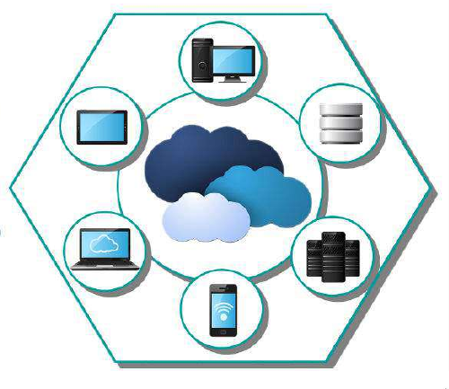
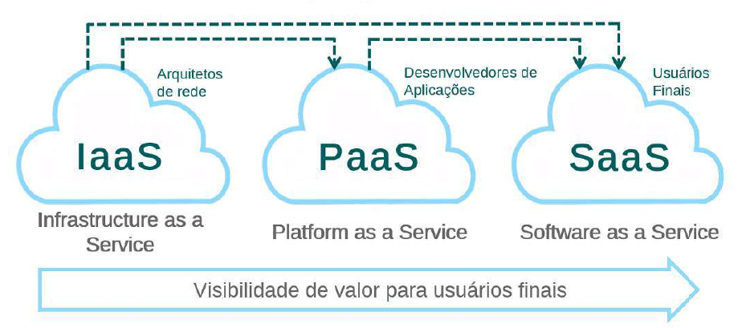

### Aula 0X -  Cloud
#### Aula X.1 Introdução ao Cloud Computing

Cloud Computing, basicamente é relacionada a possibilidade de acessr arquivos ou ter acesso a diferentes tipos de tarefas ou serviços a partir da internet, sem a necessidade de instalação de aplicativos em computador para realizar estas atividades.

Essa facilidade existe pelo fato de que os dados/serviços acessados não estão necessariamente em um computador específico, mas sim numa rede.

A definição de "nuvem" existe exatamente pelo fato de que uma vez conectado a internet, temos acesso a todas as ferramentas e serviços. Sendo assim, podemos acessar estes determinados serviços de qualquer lugar, necessitando apenas de conexão a internet.

#### Modelos de Cloud Computing

##### IaaS

Neste modelo, está ao alcance do usuário um conjunto de infraestruturas de recursos de hardware, como:

- Servidores;
- Memória RAM;
- Roteadores;
- Firewalls, etc.

##### Exemplo de IaaS
Podemos utilizar como exemplo de IaaS serviços como AWS, Google Cloud Platform, Digital Ocean, etc.

Definir vantagens e desvantagens no uso de cloud computing é bastante relativo. Pois cada infraestrutura empresarial possui uma particularidade e por muitas vezes uma solução útil e econômica para uma corporação, pode acabar não sendo tão interessante para outra.

Apesar disso, podemos listar alguns motivos que podem justificar o uso de cloud computing:

- **Substituir gasto em ativos de TI por gastos variáveis**:

No lugar de realizar grandes investimentos em datacenters e servidores antes de saber ao certo como será sua utilização, as corporações podem utilizar a computação em nuvem para pagar apenas efetivamente o que elas consomem.

- **Economias massivas de escala**:

Ao utilizar computação em nuvem, é possível se beneficiar no custo mais baixo causado pela grande quantidade de clientes que utilizam serviços em cloud. Quando a quantidade de clientes é maior a tendência é que os provedores consigam praticar preços mais baixos.

-  **Conexão com a internet**:

Uma possível limitação para utilização de serviços em cloud, pode ser a qualidade do(s) link(s) de internet utilizados por uma empresa. Como os serviços de cloud ficam disponíveis para a internet, links funcionais para ambientes corporativos acabam se tornando imprescindíveis.

##### Cloud Pública

- Dados armazenados no datacenter do provedor;
- Provedor responsável pelo gerenciamento e manutenção;
- Ambiente atraente para empresas, reduz tempo de espera para testar e implantar novos produtos;
- Percepção negativa da segurança por ser definido como "público". Porém, violações de segurança são raras.

##### Cloud Privada

- Solução conhecida como nuvem interna ou corporativa;
- Situada dentro da empresa ou hospedada em datacenter, com dados protegidos por firewall;
- Ótima opção para empresas que já possuem infraestrutura de datacenter;
- Gestão, manutenção e atualização do datacenter é responsabilidade da empresa;
- Oferece maior nível de segurança, pois compartilham poucos ou nenhum recurso com outras empresas.

##### Cloud Híbrida

- "Melhor dos dois mundos", pois combina infraestrutura local ou nuvens privadas com nuvens públicas, oferecendo vantagens de ambos os tipos;
- Dados e aplicativos podem transitar entre nuvens privadas ou públicas para maior flexibilidade e mais opções de implantação;
- Cloud Bursting.

##### OpenStack - Cloud Open Source

- Projeto opensource que possibilita construir nuvens privadas ou públicas;
- Constitui um sistema operacional para ser utilizado numa infraestrutura de cloud computing;
- Possibilita gerenciamento em larga escala, pois permite gerenciamento de todos os componentes de uma infraestrutura (computação, armazenamento, rede, etc.);
- Voltado para oferta de IaaS.

###### **Ambiente Openstack**

Para provisionar uma infraestrutura inicial de cloud computing baseada em Openstack precisamos dos projetos **CORE**:

- **Compute**: Através do projeto **NOVA** o OpenStack oferece recursos de computanção para criar instâncias, para isso ele utiliza imagens de sistemas operacionais como Ubuntu, Solaris, Windows, etc.;
- **Networking**: Através do projeto **NEUTRON** o OpenStack oferece recursos como sub-redes, roteadores, balanceadores de carga, Firewall, VPN, etc.;
- **Storage**: Através dos projetos **CINDER** **SWIFT** o OpenStack oferece armazenamento em disco para as instâncias e armazenamento de objetos para os seus usuários;
- **Dashboard**: Através do projeto **HORIZON** o OpenStack fornece aos administradores e usuários uma interface gráfica para o acesso, disponibilização e automatização dos recursos baseados em nuvem.

**OpenStack** | **AWS**
-|-
Interface Web **(Horizon)** | AWS Console
Computação **(Nova)** | EC2
Block Storage **(Cinder)** | EBS
Object Storage **(Swift)** | S3
Banco de Dados **(Trove)** | RDS / DynamoDB / Elastic Cache
Orquestração **(Heat)** | Cloud Formation
Big Data **(Sahara)** | EMR / Kinesis / Data Pipeline
Share File System **(Manila)** | Amazon EFS
DNS **(Designate)** | Amazon Route 53
Secure Storage **(Barbican)** | AWS CloudHSM
App Catalog **(Murano)** | Cloud Formation / Service Catalog
Container Management **(Magnum)** | EC2 Container Service
Mensageria **(Zaqar)** | SQS

###### **Métodos de instalação automática**

#### Aula X.2 Gerenciando Contêineres

- **DevStack**: Utiliza um shell script cujo objetivo é facilitar a criação do ambiente OpenStack;
- **PackStack**: Utiliza o Puppet para automatizar a instalação de um ambiente OpenStack em distribuições CentOS/RedHat;
- **Mirantis**: Utiliza o Vagrant para automatizar a instalação de um ambiente OpenStack.

#### Aula X.3 Configuração do Sudo
