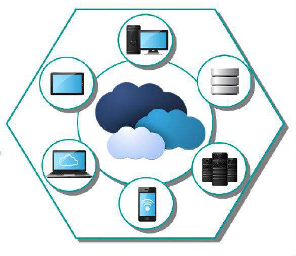
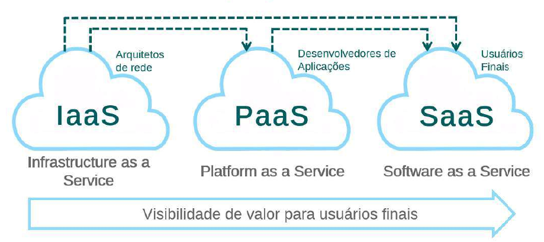
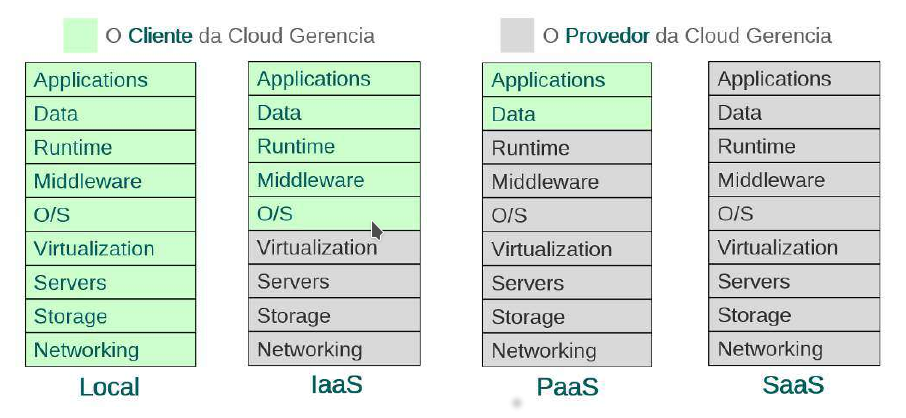
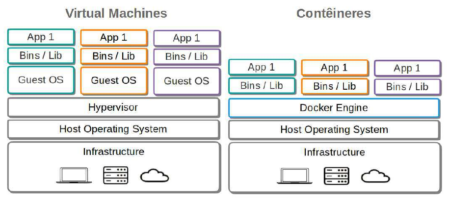
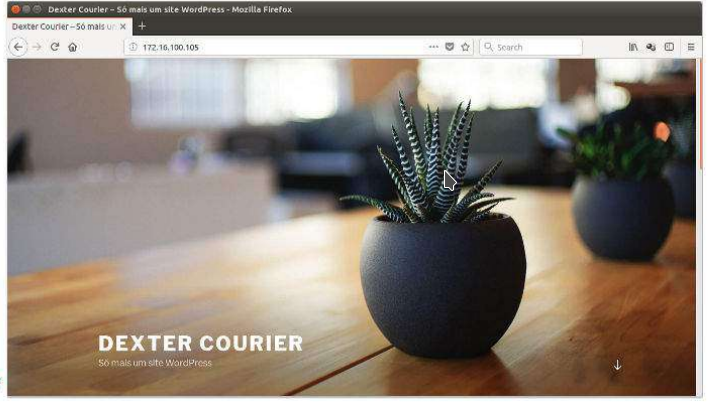
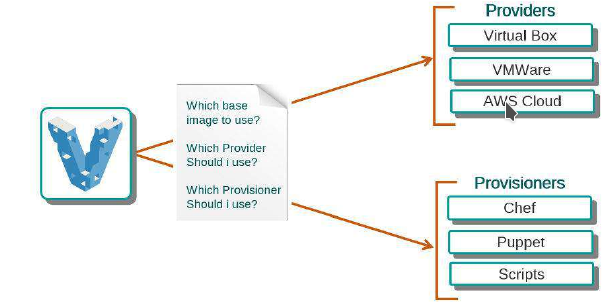

### Aula 0X -  Cloud
#### Aula X.1 Introdução ao Cloud Computing



Cloud Computing, basicamente é relacionada a possibilidade de acessr arquivos ou ter acesso a diferentes tipos de tarefas ou serviços a partir da internet, sem a necessidade de instalação de aplicativos em computador para realizar estas atividades.

Essa facilidade existe pelo fato de que os dados/serviços acessados não estão necessariamente em um computador específico, mas sim numa rede.

A definição de "nuvem" existe exatamente pelo fato de que uma vez conectado a internet, temos acesso a todas as ferramentas e serviços. Sendo assim, podemos acessar estes determinados serviços de qualquer lugar, necessitando apenas de conexão a internet.

#### Modelos de Cloud Computing



##### IaaS


Neste modelo, está ao alcance do usuário um conjunto de infraestruturas de recursos de hardware, como:

- Servidores;
- Memória RAM;
- Roteadores;
- Firewalls, etc.

##### Exemplo de IaaS
Podemos utilizar como exemplo de IaaS serviços como AWS, Google Cloud Platform, Digital Ocean, etc.



Definir vantagens e desvantagens no uso de cloud computing é bastante relativo. Pois cada infraestrutura empresarial possui uma particularidade e por muitas vezes uma solução útil e econômica para uma corporação, pode acabar não sendo tão interessante para outra.

Apesar disso, podemos listar alguns motivos que podem justificar o uso de cloud computing:

- **Substituir gasto em ativos de TI por gastos variáveis**:

No lugar de realizar grandes investimentos em datacenters e servidores antes de saber ao certo como será sua utilização, as corporações podem utilizar a computação em nuvem para pagar apenas efetivamente o que elas consomem.

- **Economias massivas de escala**:

Ao utilizar computação em nuvem, é possível se beneficiar no custo mais baixo causado pela grande quantidade de clientes que utilizam serviços em cloud. Quando a quantidade de clientes é maior a tendência é que os provedores consigam praticar preços mais baixos.

-  **Conexão com a internet**:

Uma possível limitação para utilização de serviços em cloud, pode ser a qualidade do(s) link(s) de internet utilizados por uma empresa. Como os serviços de cloud ficam disponíveis para a internet, links funcionais para ambientes corporativos acabam se tornando imprescindíveis.


##### Cloud Pública

- Dados armazenados no datacenter do provedor;
- Provedor responsável pelo gerenciamento e manutenção;
- Ambiente atraente para empresas, reduz tempo de espera para testar e implantar novos produtos;
- Percepção negativa da segurança por ser definido como "público". Porém, violações de segurança são raras.

##### Cloud Privada

- Solução conhecida como nuvem interna ou corporativa;
- Situada dentro da empresa ou hospedada em datacenter, com dados protegidos por firewall;
- Ótima opção para empresas que já possuem infraestrutura de datacenter;
- Gestão, manutenção e atualização do datacenter é responsabilidade da empresa;
- Oferece maior nível de segurança, pois compartilham poucos ou nenhum recurso com outras empresas.


##### Cloud Híbrida

- "Melhor dos dois mundos", pois combina infraestrutura local ou nuvens privadas com nuvens públicas, oferecendo vantagens de ambos os tipos;
- Dados e aplicativos podem transitar entre nuvens privadas ou públicas para maior flexibilidade e mais opções de implantação;
- Cloud Bursting.


##### OpenStack - Cloud Open Source

- Projeto opensource que possibilita construir nuvens privadas ou públicas;
- Constitui um sistema operacional para ser utilizado numa infraestrutura de cloud computing;
- Possibilita gerenciamento em larga escala, pois permite gerenciamento de todos os componentes de uma infraestrutura (computação, armazenamento, rede, etc.);
- Voltado para oferta de IaaS.

###### **Ambiente Openstack**

Para provisionar uma infraestrutura inicial de cloud computing baseada em Openstack precisamos dos projetos **CORE**:

- **Compute**: Através do projeto **NOVA** o OpenStack oferece recursos de computanção para criar instâncias, para isso ele utiliza imagens de sistemas operacionais como Ubuntu, Solaris, Windows, etc.;
- **Networking**: Através do projeto **NEUTRON** o OpenStack oferece recursos como sub-redes, roteadores, balanceadores de carga, Firewall, VPN, etc.;
- **Storage**: Através dos projetos **CINDER** **SWIFT** o OpenStack oferece armazenamento em disco para as instâncias e armazenamento de objetos para os seus usuários;
- **Dashboard**: Através do projeto **HORIZON** o OpenStack fornece aos administradores e usuários uma interface gráfica para o acesso, disponibilização e automatização dos recursos baseados em nuvem.


**OpenStack** | **AWS**
-|-
Interface Web **(Horizon)** | AWS Console
Computação **(Nova)** | EC2
Block Storage **(Cinder)** | EBS
Object Storage **(Swift)** | S3
Banco de Dados **(Trove)** | RDS / DynamoDB / Elastic Cache
Orquestração **(Heat)** | Cloud Formation
Big Data **(Sahara)** | EMR / Kinesis / Data Pipeline
Share File System **(Manila)** | Amazon EFS
DNS **(Designate)** | Amazon Route 53
Secure Storage **(Barbican)** | AWS CloudHSM
App Catalog **(Murano)** | Cloud Formation / Service Catalog
Container Management **(Magnum)** | EC2 Container Service
Mensageria **(Zaqar)** | SQS

###### **Métodos de instalação automática**

- **DevStack**: Utiliza um shell script cujo objetivo é facilitar a criação do ambiente OpenStack;
- **PackStack**: Utiliza o Puppet para automatizar a instalação de um ambiente OpenStack em distribuições CentOS/RedHat;
- **Mirantis**: Utiliza o Vagrant para automatizar a instalação de um ambiente OpenStack.


#### Aula X.2 Gerenciando Contêineres

###### Introdução ao Docker

- Docker é uma plataforma escrita em **"Go"** (linguagem de programação desenvolvida pelo Google);
- Constitui uma plataforma aberta para desenvolvedores e administradores de sistemas;
- Permite construir, compartilhar e executar aplicações distribuídas e ainda executar aplicações em contêineres.



Na máquina Docker, vamos utilizar o usuário suporte para listar contêineres, imagens e redes do Docker presentes no servidor:

```bash
~$ sudo docker ps -a
~$ sudo docker image ls
~$ sudo docker network ls
```

A seguir, vamos executar um contêiner chamado *linux-server* e listar os contêineres que estão em execução:

```bash
~$ sudo docker run -dit --name linux-server --hostname linux-server --net dexterlan ubuntu-ssh /bin/#!/usr/bin/env bash
~$ sudo docker ps:
```

###### Descrição dos comandos:

- **docker ps -a** - Lista todos os contêineres, em execução ou não;
- **docker image ls** - Lista imagens de contêineres presentes no sistema;
- **docker network ls** - Lista das redes que estão configuradas no docker;
- **docker run** - Executa um contêiner.

######  Opções do comando "docker run":
- **--dit** - Executa o contêiner em background, no modo interativo e vinculado a um TTY;
- **--name** - Define o nome do contêiner;
- **--hostname** - Define o hostname da máquina do contêiner especificado;
- **--net** - Define qual a rede o contêiner deverá utilizar.

Após executarmos o contêiner anterior, se quisermos conectar a ele quando ele já estiver em execução utilizamos o comando:

```bash
~$ sudo docker exec -it linux-server bash
```

Depois de estar conectados ao contêiner, podemos utilizar os comandos a seguir para verificar as informações:

```bash
~$ hostname
~$ cat /etc/hosts
~$ exit
```

Para removermos o contêiner em execução e não remover a imagem base do contêiner, utilizamos o comando:

```bash
~$ sudo docker rm -f $ (sudo docker ps -qa)
```

###### Descrição dos comandos:

- **docker rm** - Remove um contêiner do Docker.

###### Opções do comando "docker rm":

- **-f** ou **--force** - Força a remoção de um contêiner em execução;
- **-l** ou **--link** - Remove um link especificado;
- **-v** ou **--volumes** - Remove volumes associados a um contêiner.

Ainda na máquina docker, vamos realizar o download das imagens oficiais do **MySQL** e **Wordpress**, em seguida vamos listar se elas constam na lista de imagens do servidor:

```bash
~$ sudo docker image pull mysql:5.7.22
~$ sudo docker image pull Wordpress
~$ sudo docker image ls
```

Em seguida vamos criar pastas para armazenar os dados do wordpress e mysql:

```bash
~$ mkdir html
~$ mkdir banco
```

Depois de criar os diretórios para armazenar os dados, vamos executar um contêiner e em seguida checar se ele está em execução:

```bash
~$ sudo docker container run -e MYSQL_ROOT_PASSWORD=4linux -e MYSQL_DATABASE=wordpress --name dexter-mysql-server -v "$PWD/banco":/var/lib/mysql -d mysql:5.7.22
~$ sudo docker container ls
```

Após executar o contêiner do MySQL, vamos executar o contêiner do Wordpress:

```bash
~$ sudo docker container run -e WORDPRESS_DB_PASSWORD=4linux --name dexter-wordpress-server --link dexter-mysql-server:mysql -p 0.0.0.0:80:80 -v "$PWD/html":/var/www/html -d wordpress
~$ sudo docker container ls
```

###### Opções do comando "docker run":

- **-p** - Significa **"publish"** - Permite mapear uma porta do container no host hospedeiro;
- **-e** - Define variáveis de ambiente. Na execução do comando anterior;
- **--link** - Define um link entre contêineres mapeando o nome e a imagem do contêiner;
- **-v** - Cria um mapeamento de volumes no Docker. Em nosso exemplo, estamos mapeando o diretório; **banco** para armazenar dados do MYSQL salvos no  diretório **/var/lib/mysql** do contêiner. Para os arquivos do servidor web, mapeamos o diretório; **html** para armazenar dados salvos pelo Wordpress no diretório **/var/www/html** do contêiner.

Depois de executar os contêineres, basta acessar o endereço da nossa virtual machine (no meu caso, 172.16.100.105) num browser. O wordpress deverá estar funcionando.




#### Aula X.3 Introdução ao Vagrant

- Solução de código aberto para construção e manutenção de ambientes de desenvolvimento;
- Poder ser utilizado em conjunto com VirtualBox, VMWare e AWS;
- Auxilia no aumento de produtividade do desenvolvimento.

###### Quem utiliza o Vagrant?

- **Desenvolvedores**: Caso você seja um desenvolvedor, o Vagrant será capaz de isolar as dependências e suas configurações em um único ambiente descartável e consistente, sem sacrificar nenhuma das ferramentas com as quais vocês está habituado (editores, navegadores, depuradores, etc);

- **Operadores**: Se você é engenheiro de operações ou engenheiro de DevOps, o Vagrant é capaz de provisionar um ambiente descartável e um fluxo de trabalho confiável para desenvolver e testar scripts de gerenciamento de infraestrutura;

- **Designers**: Caso você seja um designer, o Vagrant será capaz de configurar automaticamente tudo que é necessário para o aplicativo da web, para que você possa se concentrar apenas em realizar o design do seu app/site. Pois uma vez configurado o Vagrant, não é mais necessário se preocupar em como conseguir que o aplicativo seja executado novamente.

##### Fluxo de trabalho



O Vagrant pode trabalhar com muitas tecnologias de virtualização, como VMWare, VirtualBox, Docker, AWS, etc.

O usuário final (designer, engenheiro ou desenvolvedor) precisará simplesmente acionar o comando **"vagrant up"**. Feito isso, o Vagrant realizará a leitura do **Vagrantfile** no diretório corrente e em seguida realizar as operações de virtualização (operações baseadas nas configurações definidas no **Vagrantfile**).


##### Instalação do Vagrant

Abaixo está o link que direciona para a página de download dos pacotes de instalação do Vagrant.

https://www.vagrantup.com/downloads.html


Hora de praticar.

Ao acessar a maquina Docker com o usuário suporte, vamos remover os contêineres em execução:

```bash
~$ sudo docker rm -f $(sudo docker ps -qa)
```

Após remover os contêineres, vamos checar as opções do comando vagrant:

```bash
~$ vagrant
```

Para criar uma configuração inicial do vagrant, utilizamos o subcomando **init**:

```bash
~$ vagrant init
```

###### Descrição do comandos

- **vagrant init** - Cria um arquivo **Vagrantfile** com as configurações do box que você informou no [box-name], caso você não tenha a box correspondente adicionada na máquina, é mandatório adicionar o [box-url] para que ele possa baixá-lo.


Vamos verificar se o Vagrantfile, responsável por definir as configurações do ambiente que vamos provisionar, está presente no diretório:

```bash
~$ cat Vagrantfile
```

Vamos substituir o arquivo Vagrantfile pelo arquivo de exemplo, que está configurado para utilizar o docker como provider:

```bash
~$ cp /opt/4450/Vagrantfile .
~$ cat Vagrantfile
```

###### Modelo do arquivo Vagrantfile

```bash
# -*- mode: ruby -*-
# vi: set ft=ruby :
Vagrant.configure(2) do |config|
 config.ssh.username = "root"
 config.ssh.password = "4linux"
 config.ssh.port = "2222"
 config.vm.hostname = "docker-ssh"
 config.vm.provider "docker" do |d|
  d.image = "docker-ssh"
  d.remains_running = false
  d.has_ssh = true
 end
end
```

Após copiar o arquivo de modelo, vamos checar como está o status da máquina do Vagrant que vamos provisionar:

```bash
~$ sudo vagrant status default
```

Em seguida, vamos iniciar a máquina utilizando o subcomando **up <machine>**:

```bash
~$ sudo vagrant up default
~$ sudo vagrant status default
```

###### Descrição dos comandos

- **vagrant status <nome_da_instancia>** - Informa o status atual da instância;
- **vagrant up** - Cria e inicia a instância baseando-se no arquivo Vagrantfile presente no diretório.


Vamos checar (a partir de comandos do Docker) se o contêiner provisionado pelo Vagrant está em execução:

```bash
~$ sudo docker ps -a
```

Vamos parar a execução da máquina no Vagrant e em seguida checar o seu status:

```bash
~$ sudo vagrant halt default
~$ sudo vagrant status default
```

Vamos iniciar novamente a máquina a partir do subcomando **up**

```bash
~$ sudo vagrant up default
```

###### Descrição do comando

- **vagrant halt** - Envia um comando para desligar a instância ativa, encerrando todos os processos antes de finalizá-la.


A partir do Vagrant, também podemos acessar as instâncias que criamos, para isso, podemos utilizar o protocolo ssh:

```bash
~$ sudo vagrant ssh default
```

Vamos verificar as informações da máquina do Vagrant:
```bash
~$ ip a
~$ ps aux
~$ exit
```

Para remover a instância que criamos no vagrant, podemos utilizar o subcomando **destroy**:
```bash
~$ sudo vagrant destroy default
```

###### Descrição do comando

- **vagrant ssh** - Acessa via ssh a instância criada a partir do Vagrant;
- **vagrant destroy** - Destrói a instância ativa no Vagrant.


#### LAB GAMIFICATION
